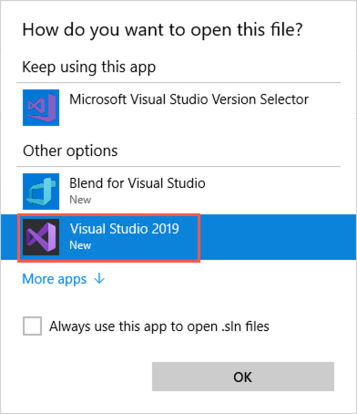
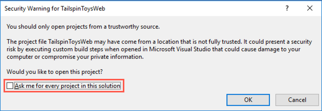

## Exercise 3: Create bus and traffic light simulated devices, and add alerts and filters

**Duration:** 60 minutes

The IoT Remote Monitoring solution allows you to provision and collect telemetry from both simulated and real devices. As part of the process, telemetry schema information is applied to the devices twin through its reported properties. The properties are read as the microservice that's executing the EventProcessor processes incoming messages from IoT Hub. The EventProcessor is an Azure Function that was deployed as part of the Remote Monitoring Accelerator. The telemetry metadata is written to Cosmos DB, and used by the Remote Monitoring web UI to extract and display the data in the charts and maps. The metadata is also used to define cloud-to-device messages and actions that can be performed on the device. The web UI uses this information to send control messages to the devices. This metadata is added to simulated and non-simulated devices alike.

In this exercise, you will define metadata for new device types that will be provisioned, and whose telemetry will be simulated by the solution. Each new device type will have a state script to generate telemetry that changes the device's state, such as speed, location, voltage, or other data that relates to the device. In addition, you will define cloud-to-device messages and actions for the new device types. Then, you will create and run a new simulation locally, using a Visual Studio solution. Finally, you will create new alerts and filters through the Remote Monitoring web app interface.

We have created the following files for you, located within the device-simulation project (Lab-files/DeviceSimulation/Services/data/devicemodels):

- Device models:

  - bus-01.json

  - bus-02.json

  - trafficlight-01.json

  - trafficlight-02.json

- Scripts (/scripts subfolder):

  - bus-01-state.js

  - bus-02-state.js

  - trafficlight-01-state.js

  - trafficlight-02-state.js

  - DecreaseTiming-method.js

  - IncreaseTiming-method.js

You will need to finish configuring these files for the simulator.

### Help references

|                                             |                                                                                                   |
| ------------------------------------------- | :-----------------------------------------------------------------------------------------------: |
| **Description**                             |                                             **Links**                                             |
| IoT Remote Monitoring device models specs   |              <https://github.com/Azure/device-simulation-dotnet/wiki/Device-Models>               |
| Creating and managing simulations           |   <https://github.com/Azure/device-simulation-dotnet/wiki/%5BAPI-Specifications%5D-Simulations>   |
| Use rules to detect issues                  |      <https://docs.microsoft.com/en-us/azure/iot-suite/iot-suite-remote-monitoring-automate>      |
| Customize the device simulator microservice |        <https://docs.microsoft.com/en-us/azure/iot-suite/iot-suite-remote-monitoring-test>        |
| IoT Remote Monitoring solution architecture | <https://docs.microsoft.com/en-us/azure/iot-suite/iot-suite-remote-monitoring-sample-walkthrough> |

### Task 1: Configure the Device Simulation projects to run locally

In this task, you will open the device-simulation solution in Visual Studio 2019 and configure the projects to run locally.

1. Browse to the device-simulation solution in the following location: Lab-files\\DeviceSimulation.

2. Open **device-simulation.sln**.

    
3. If prompted about how you want to open the file, select **Visual Studio 2019** and then select **OK**.

    

4. Select **Sign in** and enter your Azure account credentials from below.
    
    * Azure Usename/Email: <inject key="AzureAdUserEmail"></inject>
    * Azure Password: <inject key="AzureAdUserPassword"></inject>

    

5. At the security warning prompt, uncheck **Ask me for every project in this solution**, and then select **OK**.

    

3. Right-click on the **WebService** project, and select the **Set as StartUp Project** option.

   

6. In the Visual Studio toolbar, ensure the startup item is the WebService project.

    

7. Right-click on the **WebService** project and select **Properties** from the left-hand menu. Select **Debug** from the left side of the Properties window, and in the Environment variables section, populate the values for the following Environment Variables (the others can remain empty or keep their default values):

    | Environment Variable                      | Value                                 |
    |-------------------------------------------|---------------------------------------|
    | PCS_STORAGEADAPTER_WEBSERVICE_URL         | http://localhost:9022/v1              |
    | PCS_IOTHUB_CONNSTRING                     | *your IoT Hub Connection String*      |
    | PCS_AZURE_STORAGE_ACCOUNT                 | *your Azure Storage Connection String*|
    | PCS_STORAGEADAPTER_DOCUMENTDB_CONNSTRING  | *your CosmosDB Connection String*     |

    

8. Save your changes to the file.

### Task 2: Finish configuring the simulated IoT device models and scripts

In this task, you will finish configuring the device models we have provided for you.

1. With the device-simulation solution still open, use Solution Explorer to expand the **Services** project. Next, open **bus-01.json** located under **data\\devicemodels**.

    

2. Set the following Simulation.InitialState values. These are the parameters used at the start of the device simulation:

    a. **latitude**: 40.755086

    b. **longitude**: -73.984165

    c. **fuellevel**: 70.0

    d. **speed**: 30.0

    e. **vin**: Y3J9PV9TN36A4DUB9

    

3. Set the following Properties:

    a. **Type**: Bus

    b. **Location**: Contoso

    c. **Latitude**: 40.755086

    d. **Longitude**: -73.984165

    

4. There are two Telemetry schemas set for this bus. The first one should send telemetry every 10 seconds, while the other one should have an interval of one minute. Complete the Telemetry values according to the following specifications:

    a. Telemetry \#1:

    - **MessageSchema.Fields**:

      - **latitude**: double

      - **longitude**: double

      - **speed**: double

      - **speed_unit**: text

      - **vin**: text

    b. Telemetry \#2:

    - MessageTemplate (use the MessageTemplate value of the first telemetry as a guide): Include the fuellevel and fuellevel_unit fields.

    - **MessageSchema.Fields**:

      - **fuellevel**: double

      - **fuellevel_unit**: text

    

5. Save your changes.

6. Open **bus-02.json**.

7. Set the following Simulation.InitialState values. These are the parameters used at the start of the device simulation:

    a. **latitude**: 40.693935

    b. **longitude**: -73.952279

    c. **fuellevel**: 53.0

    d. **speed**: 42.0

    e. **vin**: 2K0H7PNZY0RSFQ033

    

8. Set the following Properties:

    a. **Type**: Bus

    b. **Location**: Tailwind

    c. **Latitude**: 40.693935

    d. **Longitude**: -73.952279

    

9. There are two Telemetry schemas set for this bus. The first one should send telemetry every 12 seconds, while the other one should have an interval of 55 seconds. Complete the Telemetry values according to the following specifications:

   - Telemetry \#1:

   - MessageSchema.Fields:

       - **latitude**: double

       - **longitude**: double

       - **speed**: double

       - **speed_unit**: text

       - **vin**: text

   - Telemetry \#2:

   - MessageTemplate (use the MessageTemplate value of the first telemetry as a guide): Include the fuellevel and fuellevel_unit fields.

   - MessageSchema.Fields:

     - **fuellevel**: double

     - **fuellevel_unit**: text

     

10. Save your changes.

11. Open **trafficlight-01.json**.

12. Add the following **CloudToDeviceMethods**:

    - IncreaseTiming

      - **Type**: javascript

      - **Path**: IncreaseTiming-method.js

    - DecreaseTiming

      - **Type**: javascript

      - **Path**: DecreaseTiming-method.js

    

13. Save your changes.

14. Open **trafficlight-02.json**.

15. Add the same **CloudToDeviceMethods** that you added to trafficlight-01.json.

16. Save your changes.

17. In Solution Explorer, expand the scripts subfolder (Services\\data\\devicemodels\\scripts), then open **bus-01-state.js**.

18. Scroll down to the **main** function and complete the following lines of code:

    a. Find TODO: 1 and complete the line of code underneath to set the state.speed value to a random double value with an average of 30, \~40%, a minimum value of 0 and a maximum of 80.

    b. Find TODO: 2 and complete the line of code underneath to set the state.fuellevel value to a random double value with an average of 70, \~25%, a minimum value of 2 and a maximum of 80.

    c. Your finished code should look like the following:

    ```javascript
    // 30 +/- 40%,  Min 0, Max 80
    // TODO: 1 - finish this line of code:
    state.speed = vary(30, 40, 0, 80);

    // 70 +/- 25%,  Min 2, Max 80
    // TODO: 2 - finish this line of code:
    state.fuellevel = vary(70, 25, 2, 80);
    ```

19. Save your changes.

20. Open **bus-02-state.js**.

21. Scroll down to the **main** function and complete the following lines of code:

    a. Find TODO: 3 and complete the line of code underneath to set the state.speed value to a random double value with an average of 42, \~50%, a minimum value of 0 and a maximum of 80.

    b. Find TODO: 4 and complete the line of code underneath to set the state.fuellevel value to a random double value with an average of 53, \~25%, a minimum value of 2 and a maximum of 80.

    c. Your finished code should look like the following:

    ```javascript
    // 42 +/- 50%,  Min 0, Max 80
    // TODO: 3 - finish this line of code:
    state.speed = vary(42, 50, 0, 80);

    // 53 +/- 25%,  Min 2, Max 80
    // TODO: 4 - finish this line of code:
    state.fuellevel = vary(53, 25, 2, 80);
    ```

22. Save your changes.

23. Open trafficlight-01-state.js and observe how it is altering values over time. You will see that it is varying the light state (red, green, yellow), as well as the voltage. If you look at trafficlight-02-state.js, you will notice that its voltage range is significantly higher than for the first traffic light. When we create an alert, this will most likely be the light that triggers it.

24. Open DecreaseTiming-method.js and see how it is used as an action method to reset the timing state of a traffic light by decreasing the timing 15 seconds at a time. This is executed by a cloud-to-device call from the monitoring web app.

### Task 3: Explore the remaining files to understand what is happening

Below is a table containing file paths and an explanation of what each does in the simulator. There are a few key things to point out so that you know how the Service SDK for Azure IoT Devices can be used to programmatically manage devices.

1. With the device-simulation solution still open in Visual Studio, look at each of the following files and descriptions to understand how things work:

    - Visual Studio Project: Services
      - **File Path**: Devices.cs
      - **Description**: GetAsync method (line 102) accepts a Device Id and uses it to retrieve the device details from IoT Hub, using the Service SDK's RegistryManager. It will optionally retrieve the device twin which can be used to view the current twin properties and update their values. CreateAsync method (line 156) is used to provision a new IoT Device, using the RegistryManager. It also creates a new device twin containing the IsSimulated tag. This is how the IoT Monitor app can differentiate between simulated and physical devices.

    - Visual Studio Project: Services
        - **File Path**: DeviceClient.cs
        - **Description**: SendMessageAsync method (line 100) constructs a new Message object that it will send to IoT Hub. It includes the event message properties to include the message content type (JSON), and the schema name, as defined in the device model scripts you edited earlier. The microservice running the IoT Hub EventProcessor will look for these values before processing messages and saving them to Cosmos DB.

    - Visual Studio Project: SimulationAgent
        - **File Path**: SimulationManager.cs
        - **Description**: Each device is assigned an instance of a DeviceStateActor (DeviceState\\DeviceStateActor.cs), DeviceConnectionActor (DeviceConnection\\DeviceConnectionActor.cs), DeviceTelemetryActor (DeviceTelemetry\\DeviceTelemetryActor.cs), DevicePropertiesActor(DeviceProperties\\DevicePropertiesActor.cs), and DeviceReplayActor(DeviceReplay\\DeviceReplayActor.cs). This class manages all of the actors for this solution - generated through the *TryToCreateActorsForPartitionAsync* and *CreateActorsForDeviceAsync*. Through the actors, the simulated device will:
            - Connect to IoT Hub.
            - Bootstrap the device to retrieve it, create if necessary, and update the device twin state.
            - Update the device state using the state scripts we created, in order to send telemetry.
            - Sends telemetry using the message template provided, as seen in the bus and traffic light device model scripts you edited earlier. Uses the DeviceClient class to send the message through the Device SDK for Azure IoT Devices.

    - Visual Studio Project: WebService
        - **File Path**: v1\\Controllers\\SimulationsController
        - **Description**: This web API controller contains REST methods that allow you to retrieve, insert, update, and delete device simulations. The simulation values are updated in Cosmos DB by way of the Simulations service (Services project -- Simulations.cs), which uses the running pcs-storage-adapter service to modify the values in Cosmos DB. We will be using this next.

### Task 4: Configure and run the Storage Adapter project

The Storage Adapter project (pcs-storage-adapter) is another microservice that constantly runs and provides REST-based endpoints to manage simple key/value data in Cosmos DB. It is used by several services, including the web service within the device-simulator project, as seen in the previous task. This needs to be configured, then executed to run before creating and running simulations on the new devices locally.

1. Browse to the storage-adapter solution in the following location: LabFiles\\StorageAdapter.

2. Open **storage-adapter.sln**.

    

3. Right-click on the **WebService** project, and select the **Set as StartUp Project** option.

   

4. In the Visual Studio toolbar, ensure the startup item is the WebService project.

    

5. Right-click the **WebService** project in the Solution Explorer, then select **Properties**.

    

6. Select **Debug** from the left-hand menu. In the Environment variables section, populate the following variables:

    | Environment Variable         | Value                                 |
    |------------------------------|---------------------------------------|
    | PCS_KEYVAULT_NAME            | *your key vault name*                 |
    | PCS_AAD_APPID                | *the value for aadAppId from the Key Vault*  |
    | documentDBConnectionString   | *your Cosmos DB Connection String*    |
    | PCS_AAD_APPSECRET            | *the value for aadAppSecret from the Key Vault*     |

    

7. Save your changes to the file.

8. Right-click the **WebService** project once again, then select **Start new instance** under **Debug**.

    

9. Starting the project will bring up a console window indicating the service is now listening on port 9022.

    

10. Open a new browser window and go to the following path: <http://localhost:9022/v1/status>. You should also see a status response on the page showing the service is alive and well.

    

11. Leave the project running in debug mode.

### Task 5: Run the Simulator web service and create a new simulation

In this task, you will run the Simulator web service locally and send REST-based commands to it to delete the existing simulation and define a new one using only the devices we want to simulate for the lab, including the new device types.

1. Switch back to the **device-simulation** solution in Visual Studio. Right-click the **WebService** project, then select **Start new instance** under **Debug**, to run a new instance of the web app.

    

2. This will launch a new command window with console statements flowing through.

   

3. Open **Postman**. You should have it installed from the lab's prerequisites. If not, refer to the link to install Postman found there.

4. Add a new request. Select the **POST** method and enter <http://localhost:9003/v1/simulations> as the URL.

5. Select **Headers** beneath the URL and add the following Key / Value pair:

    a. **Key**: Content-Type

    b. **Value**: application/json

    

6. Select **Body**, select **raw**, then **JSON (application/json)** as the content type. Paste the following to create a new simulation with our new models - remember to add your IoT Hub Connection string to the **IoTHubs** property:

    ``` javascript
    {
        "Name": "Smart City Simulation",
        "Enabled": true,
        "IoTHubs": [
            {
                "ConnectionString": "YOUR_IOT_HUB_CONNECTION_STRING"
            }
            ],
            "DeviceModels": [
                {
                    "Id": "bus-01",
                    "Count": 1
                },
                {
                    "Id": "bus-02",
                    "Count": 1
                },
                {
                    "Id": "trafficlight-01",
                    "Count": 1
                },
                {
                    "Id": "trafficlight-02",
                    "Count": 1
                }
            ]
    }

    ```

    

7. Press **Send**. You should receive a response status of 200 OK, and output showing the new simulation information with your defined devices. The Enabled value should also be true.

    

8. Leave this project running in the background.

### Task 6: Create alerts and filters in the monitoring web app

The IoT Remote Monitoring web interface enables you to create filters that help group devices by type or other parameters. You can also create alerts that are fired when certain criteria are met, enabling you to see the alerts alongside your device data or on the map. In this task, you will create filters for your buses and traffic lights, then create an alert for traffic lights whose voltage exceed a predefined level.

1. Navigate back to the monitoring web app. If you don't remember the path or have closed the previous browser session, the naming convention is **https://[your solution name].azurewebsites.net/dashboard**. You may need to refresh the browser window if it has been running for some time and is unresponsive.

2. One of the first things you may notice is that there are new telemetry data points listed above the graph. You should also see new devices showing up on the map. In the screenshot below, the new fuel level telemetry option is selected, and data for the two new buses appear beneath. (Note: You may need to wait a few minutes with the simulator running in order for the New York data points to appear - zoom out the map to see them.)

    

    

3. Create a new device group by selecting **Manage device groups** on the upper-right portion of the dashboard.

    

4. Select **+ Create new device group**, then provide the following parameters in the form:

    a. **Name**: Buses

    b. **Field**: Properties.Reported.Type

    c. **Operator**: = Equals

    d. **Value**: Bus

    e. **Type**: Text

    

5. Select **Save**.

6. Create another device group with the following parameters in the form:

    a. **Name**: Traffic Lights

    b. **Field**: Properties.Reported.Type

    c. **Operato**r: = Equals

    d. **Value**: Traffic Light

    e. **Type**: Text

7. After creating both device groups, you may select them using the filter drop-down list on the top of the **Dashboard** screen. In the screenshot below, we have selected Buses. Notice that the shows only the two Bus devices.

    

8. Select **Rules** in the left-hand menu.

9. Change the filter to show All devices so you can view the list of existing rules. Each one has a unique name and description, are marked with a severity level, and have filters and triggers to apply the rule to specific devices and act on certain criteria. Select **+ New rule** to create a new rule for the traffic lights.

    

10. Specify the following values in the New rule form:

    a. **Rule Name**: Voltage Too High

    b. **Description**: Traffic light voltage is higher than normal.

    c. **Device group**: Select your Traffic Lights group.

    d. **Calculation**: Select Instant.

    e. **Condition1**:

    - **Field**: voltage

    - **Operator**: \>=

    - **Value**: 74

    f. **Severity level**: Critical

    g. **Rule status**: Enabled

    

    

11. Select **Apply**. Notice that it shows 2 devices are affected by this rule.

12. Navigate back to the dashboard. It may take a few minutes for the alerts to start appearing. When you filter by Traffic Lights and zoom in on the map over New York, you will see both traffic lights pinned to the map. One with the critical alert. Also notice the alarm count on the left.

    

13. Select the **traffic light** with the error indicator on the map. The device details will be displayed to the right, along with a list of the triggered alarms.

14. Select **Maintenance** on the left-hand menu.

15. Select the **Voltage Too High** alert. You will see a list of occurrences and devices that triggered the alarm. Using the menu on top, you can close or acknowledge alerts for each selected occurrence in the list.

    

### Task 7: Send jobs to IoT devices

In this task, you will send a job to one of the traffic light devices, using the DecreaseTiming job defined in the scripts folder of the device-simulation project.

1. Navigate back to the monitoring web app's dashboard.

2. Select the **timing** telemetry option. Observe the current timing for the traffic lights. One should consistently be 90 (seconds), and the other 65.

    

3. Navigate to **Device Explorer** using the left-hand menu.

4. Check the box next to **GUIDVALUE.Trafficlight-01.1** (or whichever the traffic light \#1 is named in your list - the names could be long, so selecting one will open an overview blade displaying the full name of the device).

5. Select **Jobs** in the top menu.

6. Select **Methods** for the job type.

7. In the **Method Name**, select **DecreaseTiming**.

8. Provide any name for your Job.

9. Select **Apply**. You may view the job status in the maintenance page, if desired.

    

10. Navigate back to the dashboard and view the **timing** telemetry once again. This time, you should notice that the traffic light timing for traffic light \#1 decreased from 90 seconds to 75. (You may need to wait a couple of minutes to see the effect in the chart)

    
