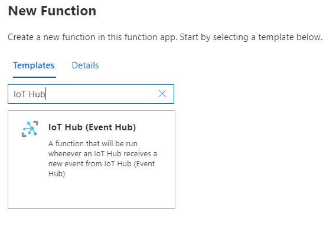
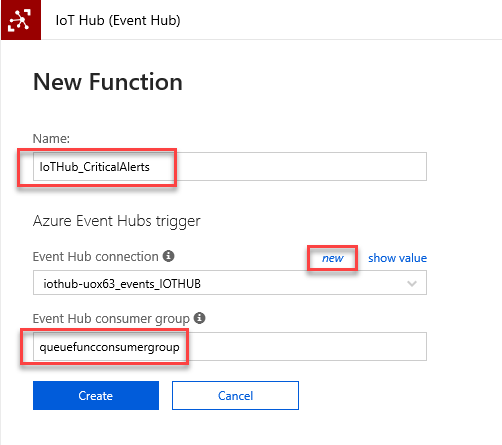
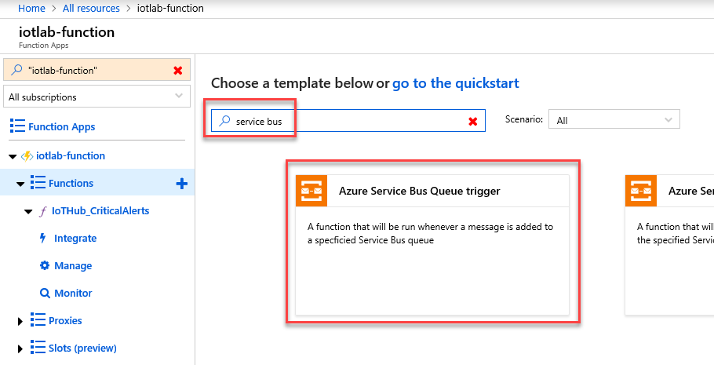
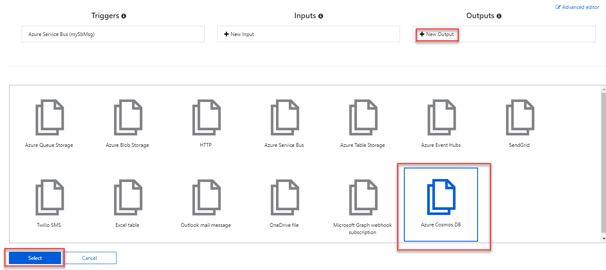
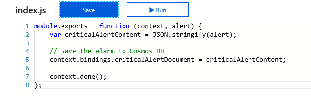
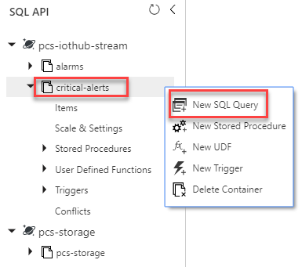

<div class="MCWHeader1">
IoT and the Smart City
</div>

<div class="MCWHeader2">
Hands-on lab step-by-step
</div>

<div class="MCWHeader3">
June 2020
</div>

Information in this document, including URL and other Internet Web site references, is subject to change without notice. Unless otherwise noted, the example companies, organizations, products, domain names, e-mail addresses, logos, people, places, and events depicted herein are fictitious, and no association with any real company, organization, product, domain name, e-mail address, logo, person, place or event is intended or should be inferred. Complying with all applicable copyright laws is the responsibility of the user. Without limiting the rights under copyright, no part of this document may be reproduced, stored in or introduced into a retrieval system, or transmitted in any form or by any means (electronic, mechanical, photocopying, recording, or otherwise), or for any purpose, without the express written permission of Microsoft Corporation.

Microsoft may have patents, patent applications, trademarks, copyrights, or other intellectual property rights covering subject matter in this document. Except as expressly provided in any written license agreement from Microsoft, the furnishing of this document does not give you any license to these patents, trademarks, copyrights, or other intellectual property.

The names of manufacturers, products, or URLs are provided for informational purposes only, and Microsoft makes no representations and warranties, either expressed, implied, or statutory, regarding these manufacturers or the use of the products with any Microsoft technologies. The inclusion of a manufacturer or product does not imply endorsement of Microsoft of the manufacturer or product. Links may be provided to third-party sites. Such sites are not under the control of Microsoft and Microsoft is not responsible for the contents of any linked site or any link contained in a linked site, or any changes or updates to such sites. Microsoft is not responsible for webcasting or any other form of transmission received from any linked site. Microsoft is providing these links to you only as a convenience, and the inclusion of any link does not imply endorsement of Microsoft of the site or the products contained therein.

© 2020 Microsoft Corporation. All rights reserved.

Microsoft and the trademarks listed at <https://www.microsoft.com/en-us/legal/intellectualproperty/Trademarks/Usage/General.aspx> are trademarks of the Microsoft group of companies. All other trademarks are the property of their respective owners.

**Contents**

<!-- TOC -->

- [IoT and the Smart City hands-on lab step-by-step](#iot-and-the-smart-city-hands-on-lab-step-by-step)
  - [Abstract and learning objectives](#abstract-and-learning-objectives)
  - [Overview](#overview)
  - [Solution architecture](#solution-architecture)
  - [Requirements](#requirements)
  - [Exercise 1: Set up the IoT Remote Monitoring solution environment](#exercise-1-set-up-the-iot-remote-monitoring-solution-environment)
    - [Help references](#help-references)
    - [Task 1: Provision the Remote Monitoring Solution](#task-1-provision-the-remote-monitoring-solution)
    - [Task 2: Stop running device simulation in the Remote Monitoring Solution](#task-2-stop-running-device-simulation-in-the-remote-monitoring-solution)
  - [Exercise 2: Provision additional Azure services](#exercise-2-provision-additional-azure-services)
    - [Help references](#help-references-1)
    - [Task 1: Create Service Bus queue](#task-1-create-service-bus-queue)
    - [Task 2: Create the Critical Alerts container in Cosmos Db](#task-2-create-the-critical-alerts-container-in-cosmos-db)
    - [Task 3: Review the consumer groups in the IoT Hub](#task-3-review-the-consumer-groups-in-the-iot-hub)
    - [Task 4: Review the Azure Time Series Insights instance](#task-4-review-the-azure-time-series-insights-instance)
    - [Task 5: Provision an Azure Container Registry](#task-5-provision-an-azure-container-registry)
    - [Task 6: Obtain the Storage Account Connection String](#task-6-obtain-the-storage-account-connection-string)
    - [Task 7: Create storage account containers required for the lab](#task-7-create-storage-account-containers-required-for-the-lab)
    - [Task 8: Retrieve Secrets from the Key Vault](#task-8-retrieve-secrets-from-the-key-vault)
  - [Exercise 3: Create bus and traffic light simulated devices, and add alerts and filters](#exercise-3-create-bus-and-traffic-light-simulated-devices-and-add-alerts-and-filters)
    - [Help references](#help-references-2)
    - [Task 1: Configure the Device Simulation projects to run locally](#task-1-configure-the-device-simulation-projects-to-run-locally)
    - [Task 2: Finish configuring the simulated IoT device models and scripts](#task-2-finish-configuring-the-simulated-iot-device-models-and-scripts)
    - [Task 3: Explore the remaining files to understand what is happening](#task-3-explore-the-remaining-files-to-understand-what-is-happening)
    - [Task 4: Configure and run the Storage Adapter project](#task-4-configure-and-run-the-storage-adapter-project)
    - [Task 5: Run the Simulator web service and create a new simulation](#task-5-run-the-simulator-web-service-and-create-a-new-simulation)
    - [Task 6: Create alerts and filters in the monitoring web app](#task-6-create-alerts-and-filters-in-the-monitoring-web-app)
    - [Task 7: Send jobs to IoT devices](#task-7-send-jobs-to-iot-devices)
  - [Exercise 4: Create IoT Edge device and custom modules](#exercise-4-create-iot-edge-device-and-custom-modules)
    - [Help references](#help-references-3)
    - [Task 1: Add a new IoT Edge device](#task-1-add-a-new-iot-edge-device)
    - [Task 2: Provision new Linux virtual machine to run as the IoT Edge device](#task-2-provision-new-linux-virtual-machine-to-run-as-the-iot-edge-device)
    - [Task 3: Create and upload the custom C\# IoT Edge module for vehicle telemetry](#task-3-create-and-upload-the-custom-c-iot-edge-module-for-vehicle-telemetry)
    - [Task 4: Create the Azure Stream Analytics IoT Edge module](#task-4-create-the-azure-stream-analytics-iot-edge-module)
    - [Task 5: Deploy custom modules to IoT Edge device](#task-5-deploy-custom-modules-to-iot-edge-device)
  - [Exercise 5: Create an Azure Function to add critical engine alerts to the Service Bus Queue](#exercise-5-create-an-azure-function-to-add-critical-engine-alerts-to-the-service-bus-queue)
    - [Task 1: Create a new Function App](#task-1-create-a-new-function-app)
    - [Task 2: Add new Function to process messages received by the IoT Hub](#task-2-add-new-function-to-process-messages-received-by-the-iot-hub)
  - [Exercise 6: Run a console app to view critical engine alerts from the Service Bus Queue](#exercise-6-run-a-console-app-to-view-critical-engine-alerts-from-the-service-bus-queue)
    - [Help references](#help-references-4)
    - [Task 1: Retrieve the Service Bus Queue Connection string](#task-1-retrieve-the-service-bus-queue-connection-string)
    - [Task 2: Configure and execute the ReadEngineAlerts solution in Visual Studio 2019](#task-2-configure-and-execute-the-readenginealerts-solution-in-visual-studio-2019)
  - [Exercise 7: Create an Azure Function to ingest critical engine alerts and store them in Cosmos DB](#exercise-7-create-an-azure-function-to-ingest-critical-engine-alerts-and-store-them-in-cosmos-db)
    - [Help references](#help-references-5)
    - [Task 1: Create a new Function](#task-1-create-a-new-function)
    - [Task 2: Add an Azure Cosmos DB output to the critical-alerts collection](#task-2-add-an-azure-cosmos-db-output-to-the-critical-alerts-collection)
    - [Task 3: Modify the function code](#task-3-modify-the-function-code)
    - [Task 4: View data stored by the function in Azure Cosmos DB](#task-4-view-data-stored-by-the-function-in-azure-cosmos-db)
  - [Exercise 8: View critical engine alerts in the IoT Remote Monitoring web interface](#exercise-8-view-critical-engine-alerts-in-the-iot-remote-monitoring-web-interface)
    - [Task 1: View the bus data coming from IoT Edge](#task-1-view-the-bus-data-coming-from-iot-edge)
    - [Task 2: Define new alert rules for buses](#task-2-define-new-alert-rules-for-buses)
  - [Exercise 9: Add a tag to IoT Edge Device Twin](#exercise-9-add-a-tag-to-iot-edge-device-twin)
    - [Task 1: Create the tag update job](#task-1-create-the-tag-update-job)
    - [Task 2: Verify tag update in the device twin](#task-2-verify-tag-update-in-the-device-twin)
    - [Task 3: Create new IoT Edge device group](#task-3-create-new-iot-edge-device-group)
  - [Exercise 10: Process cold data through an event hub](#exercise-10-process-cold-data-through-an-event-hub)
    - [Task 1: Verify cold data is being received in cloud storage](#task-1-verify-cold-data-is-being-received-in-cloud-storage)
    - [Task 2: Create an event hub to receive the cold data](#task-2-create-an-event-hub-to-receive-the-cold-data)
    - [Task 3: Add an input to Stream Analytics to pull the data in from Telemetry storage](#task-3-add-an-input-to-stream-analytics-to-pull-the-data-in-from-telemetry-storage)
    - [Task 4: Add an output to Stream Analytics to forward data to an Event Hub](#task-4-add-an-output-to-stream-analytics-to-forward-data-to-an-event-hub)
    - [Task 5: Modify the Stream Analytics Query to send data from storage to the event hub](#task-5-modify-the-stream-analytics-query-to-send-data-from-storage-to-the-event-hub)
  - [Exercise 11: View all data in Azure Time Series Insights](#exercise-11-view-all-data-in-azure-time-series-insights)
    - [Help references](#help-references-6)
    - [Task 1: Add your account as a Contributor to the Data Access Policies](#task-1-add-your-account-as-a-contributor-to-the-data-access-policies)
    - [Task 2: Add the cold data event hub as an event source into Time Series Insights](#task-2-add-the-cold-data-event-hub-as-an-event-source-into-time-series-insights)
    - [Task 3: Go to the Time Series Insights environment and use the data explorer](#task-3-go-to-the-time-series-insights-environment-and-use-the-data-explorer)
    - [Task 3: View the simulated and IoT Edge bus data side-by-side](#task-3-view-the-simulated-and-iot-edge-bus-data-side-by-side)
    - [Task 4: Use Perspective View to create a simultaneous view of up to four unique queries](#task-4-use-perspective-view-to-create-a-simultaneous-view-of-up-to-four-unique-queries)
  - [After the hands-on lab](#after-the-hands-on-lab)
    - [Task 1: Deprovision the accelerator through the website](#task-1-deprovision-the-accelerator-through-the-website)

<!-- /TOC -->

# IoT and the Smart City hands-on lab step-by-step

## Abstract and learning objectives

In this hands-on-lab, you will build an end-to-end smart city solution. We will begin with deploying the Azure IoT Remote Monitoring Accelerator. This accelerator is meant to serve as an example of the recommendations set forth in the [Azure IoT Reference Architecture](https://docs.microsoft.com/en-us/azure/architecture/reference-architectures/iot/). This accelerator may also serve as a customizable foundation for any real-world Remote Monitoring IoT systems. It has been built with the flexibility to define telemetry schemas, device types, groups, rules, and more. The Remote Monitoring accelerator also supports both simulated and real IoT devices - including an IoT Edge devices. The Remote Monitoring Web application displays all IoT data with charts and alerts based on pre-configured rules for each type of IoT device. You will also use this custom web app to configure IoT devices and send control messages to them via the IoT Hub.

In this lab, we will deploy an Edge Device with a custom built module along with an on-device analytics engine which intelligently filters vehicle telemetry data for anomalies and transmits only this subset of data to IoT Hub thus reducing noise and saving on bandwidth and its associated costs. Non-critical data will be sent to storage on the device and uploaded to the cloud once connectivity is established. All telemetry data will also be stored in Time Series Insights in the cloud and ordered based on the timestamp in the telemetry message. All critical data will also flow through an Azure Function that routes critical alerts to a Service Bus Queue for separate processing and storage.

At the end of this hands-on lab, you will be better able to build an end-to-end IoT solution that processes and analyzes data both in the field and in the cloud.

## Overview

The IoT and the Smart City hands-on lab is an exercise that will challenge you to implement an end-to-end scenario using a supplied sample that is based on IoT Hub, IoT Edge devices, Cosmos DB, Time Series Insights, Service Bus, and related Azure services. The hands-on lab can be implemented on your own, but it is highly recommended to pair up with other members at the lab to model a real-world experience and to allow each member to share their expertise for the overall solution.

## Solution architecture


The solution begins with an **IoT Edge Device** that would be installed on each city bus, which is responsible for reading the vehicle telemetry from the bus, such as speed, fuel level, oil level, engine temperature, etc., generated by **custom C\# module**. A **Stream Analytics module** is loaded on the IoT Edge device to filter the vehicle telemetry data so that only anomalies are sent to **IoT Hub**, all data is also stored locally on the device in the **Edge Storage Module**. The Edge Storage module is configured to upload data to Azure Blob Storage when adequate connectivity is achieved. A GPS IoT device is separately added to the bus to periodically send location and speed data to IoT Hub.

An IoT device is added to various traffic lights to send timing and voltage telemetry. It is registered as a device in IoT Hub, including properties such as its longitude and latitude and serial number. It can receive cloud-to-device messages through IoT Hub, allowing upstream services to send updates like adjusting the timing of its lights. The bus and traffic light devices are simulated using the IoT Remote Monitoring solution device simulator.

The Azure IoT Hub is configured with multiple consumer groups. This allows multiple downstream services to simultaneously read the incoming data.  **Time Series Insights** instance and an Azure Function microservice will read the incoming data. Time Series Insights is used to store the raw time series data and provides advanced filtering, custom ad-hoc queries, and visualizations that can overlay data from several classes of IoT devices. A second input into Time Series Insights provides the path for non-critical vehicle telemetry to be included from BLOB Storage.

An **Azure Function** using a separate consumer group routes filtered bus engine-related critical messages to a **Service Bus Queue**, where another **Azure Function** is triggered and outputs the critical alerts to a new collection in Cosmos DB.

The web app, which is part of the IoT Remote Monitoring solution, uses Device Twin information to display IoT devices on a map, provide real-time charts, and allows you to manage alert rules and device control messages. It is also used to provision new IoT devices and send manual cloud-to-device messages through IoT Hub.

## Requirements

- Microsoft Azure subscription (non-Microsoft subscription) where you are at least a co-administrator.

- **Global Administrator role** for Azure AD within your subscription.

- Local machine or a virtual machine configured with:

>**Note**: Included below is instruction on automating the creation of an Azure VM that includes all of the necessary software to complete the labs. Perform Task 1 only if you do not want to run locally. **It is important to complete these steps the day before the lab**!

  - Visual Studio Code version 1.38.1 or higher

    - <https://code.visualstudio.com/>

  - Azure IoT Edge extension for Visual Studio Code

    - <https://marketplace.visualstudio.com/items?itemName=vsciot-vscode.azure-iot-edge>

  - C\# for Visual Studio Code (powered by OmniSharp) extension

    - <https://marketplace.visualstudio.com/items?itemName=ms-vscode.csharp>

  - Docker Desktop on the same computer that has Visual Studio Code

    - <https://docs.docker.com/engine/installation/>

  - .NET Core 2.2 SDK

    - <https://dotnet.microsoft.com/download>

  - Visual Studio Community 2019 or greater, version 16.2.5 or higher

    - <https://www.visualstudio.com/vs/>

  - Azure development workload for Visual Studio 2019

    - <https://docs.microsoft.com/azure/azure-functions/functions-develop-vs#prerequisites>

  - .NET desktop development workload for Visual Studio 2019

  - ASP.NET and web development workload for Visual Studio 2019

  - Node.js (install using either the 32-bit or 64-bit Windows Installer (.msi) option)

    - <https://nodejs.org/en/download/>

  - Postman app

    - <https://www.getpostman.com/apps>

  - Bash client (such as Git Bash or Bash on Ubuntu for Windows)

    - Instructions for installing the Windows Subsystem for Linux for using Bash: <https://docs.microsoft.com/en-us/windows/wsl/install-win10>

## Exercise 1: Set up the IoT Remote Monitoring solution environment

**Duration:** 30 Minutes

In this exercise, you will take advantage of the 'Remote Monitoring' Microsoft Azure IoT Solution Accelerator. This accelerator will provision the components required to implement the IoT Remote Monitoring solution. This includes an Azure Resource Group, IoT Hub, Azure Storage account, App Service for hosting the monitoring web application, Device Provisioning Services, Virtual Machine, and related components that host the Function Application microservices responsible for creating, capturing, and processing IoT device messages, and a Cosmos DB instance for storing reference, alert, and telemetry data.

### Help references

|                                                      |                                                                                |
| ---------------------------------------------------- | :----------------------------------------------------------------------------: |
| **Description**                                      |                                   **Links**                                    |
| Remote Monitoring solution accelerator for Azure IoT | <https://www.azureiotsolutions.com/Accelerators#description/remote-monitoring> |

### Task 1: Provision the Remote Monitoring Solution

1. Open a new web browser tab, and access **<https://www.azureiotsolutions.com>**.

2. Select the **User Icon** in the upper right corner, and sign in with your **Azure Credentials**.

    

3. In the **Deploy a Microsoft solution accelerator** section, select the **Remote Monitoring** solution.

    

4. This will bring you to a description screen for the Remote Monitoring Accelerator. This screen provides details surrounding the benefits of the template, the documentation, GitHub links, and the Azure Services that will be provisioned. Provisioning of these Azure Services is automated. Press the **Try Now** button to start the provisioning process.

5. The first step in provisioning the accelerator is to provide a deployment name. Enter **iot-remote-monitoring**, select the desired Azure subscription, for Deployment Options, select **C# Microservices**, then select the Azure Location nearest you. Finally, press the **Create** button.

    

6. The second step to provisioning the accelerator requires no intervention on your part. A checklist of provisioning steps will be displayed and is updated in real-time as they are completed. Please wait until provisioning has completed.

    

7. Once completed, you will be shown a success screen with a link allowing you to view your installed solution accelerator.

    

8. Alternatively, you may access installed accelerators in your account by selecting the **My Solutions** link on the [Azure IoT Solution Accelerators website](https://www.azureiotsolutions.com). Selecting an accelerator from this list will bring you to the screen shown in the previous step, where you can follow the **Go to your solution accelerator** link.

    

9. Upon launching the Remote Monitoring accelerator, you may be prompted to consent to accessing the Azure Portal to view the resources provisioned. Simply check the **Consent on behalf of your organization** and press the **Accept** button.

    

10. When the Remote Monitoring solution is loaded, it will bring you into the Dashboard view. A series of simulated devices are feeding the portal with live data that is displayed in maps, charts, and metrics.

    

11. Make a note of the URL of your Remote Monitoring web application - you will be utilizing this throughout this lab.

12. In the Azure Portal, you are able to see a listing of the resources provisioned to support the Remote Monitoring Accelerator solution. Access the [Azure Portal](https://portal.azure.com) and log in with your Azure credentials.

13. View the resources provisioned by the accelerator by choosing **Resource Groups** in the left-hand menu, then selecting the resource group that you entered in step 5 of this exercise, **iot-remote-monitoring**.

    

### Task 2: Stop running device simulation in the Remote Monitoring Solution

1. Navigate to your Remote Monitoring web application by pasting the URL in a browser window.

2. When the site loads, select the **gear** icon on the upper-right corner.

3. Shift the **Flowing** switch to stop the current device simulation. We will replace the simulated devices with our own.

    

4. After stopping the simulation, take a moment to browse through the site. You will notice an interactive map as the centerpiece, provided by the Azure Maps service that was provisioned as part of the solution. This will display each of your IoT devices that have location information.

    a. To the left of the map is a count of the devices, as well as the number of alarms and warnings that have been triggered based on pre-configured rules. We will add custom rules later on.

    b. Directly to the right of the map is a list of system alarms for the displayed devices.

    c. Beneath the map is a flowing line chart that displays telemetry data for selected devices and data points.

    d. To the right of the chart is a list of system KPIs (key performance indicators) that shows the number of alarms by device type and whether that number is increasing or decreasing.

   

## Exercise 2: Provision additional Azure services

**Duration:** 45 minutes

Use the Azure portal to create services that will be used by the overall IoT solution environment. You will create an additional consumer group on the default messages/events IoT Hub endpoint. This will allow us to add more readers that can read the massive amounts of incoming IoT data being ingested by IoT Hub. This will help prevent conflicts from multiple readers attempting to modify the checkpoints and offsets of the partitions holding the messages. Next, you will review the already provisioned Azure Time Series Insights instance to collect, filter, and display all-time series data flowing in from your simulated IoT devices as well as your IoT Edge device. In this exercise, you will provision a service bus queue to house engine alerts, a container registry to hold the custom Vehicle Telemetry module, and additional storage account containers that are required later in the lab.

### Help references

|                                                         |                                                                                           |
| ------------------------------------------------------- | :---------------------------------------------------------------------------------------: |
| **Description**                                         |                                         **Links**                                         |
| Remote Monitoring preconfigured solution with Azure IoT |              https://github.com/Azure/azure-iot-pcs-remote-monitoring-dotnet              |
| What is Azure Time Series Insights?                     | https://docs.microsoft.com/en-us/azure/time-series-insights/time-series-insights-overview |

### Task 1: Create Service Bus queue

In this task, you will provision a new Service Bus queue that will be used for routing special bus engine-related critical alerts. Afterward, you will create an Azure Function triggered by incoming IoT Hub messages and route filtered messages to this queue.

1. Using a new tab or instance of your browser navigate to the **Azure Management** portal, <http://portal.azure.com>.

2. Expand the left menu and select **+ Create a Resource**, then type **Service Bus** into the search box. Select **Service Bus** from the results.

    

3. Select the **Create** button on the Service Bus overview blade.

4. On the Create namespace screen, specify the following configuration options:

    a. Select the **Subscription** where the accelerator was deployed.

    b. Select a **Resource Group**, ensuring it's the same one in which the accelerator components have been created.

    c. **Namespace Name**: Unique value for the namespace name (ensure the green check mark appears).

    d. Select the same **Location** as your Resource Group and other services.

    e. Select the **Standard** pricing tier.

    

5. Select **Create**.

6. Navigate to the new **resource** after it has been created.

7. On the overview blade of your Service Bus, select **+ Queue** to create a new queue.

    

8. On the **Create queue** blade, specify the following configuration options:

    a. **Name**: alert-q

    b. **Max queue size**: 1 GB

    c. Leave the remaining values at their defaults. It is important to note that you must **not** enable duplicate detection or sessions on queues These settings will cause unexpected results and failures if applied.

    

9. Select **Create**.

### Task 2: Create the Critical Alerts container in Cosmos Db

1. Open your Azure Cosmos DB account by opening your resource group, and then selecting the Azure Cosmos DB account name. Select **Data Explorer** from the left-hand menu.

    

2. There are currently two databases and two containers:

    a. **Database**: pcs-storage

    - **Container**: pcs-storage

      - **Description**: contains configuration data for the IoT Remote Monitoring solution.

    b. **Database**: pcs-iothub-stream

    - **Container**: alarms

      - **Description**: This is the container that holds all IoTHub messages that the remote monitoring solution receives.

3. Select **New Container**.

    

4. In the Add Collection form, specify the following:

    a. Select **Use existing** radio button.

    b. **Database Id**: pcs-iothub-stream

    c. **Container Id**: critical-alerts

    d. **Partition key**: /vin

    e. **Throughput**: 1000

    

5. Select **OK**.

6. Next, we will obtain the connection string for Cosmos DB. From the left-hand menu, in the **Settings** section, select **Keys**. Then copy the **Primary Connection String** value and save it for use later on in this lab.

   

### Task 3: Review the consumer groups in the IoT Hub

In this task, you will review the consumer groups that were added to the default messages/events IoT Hub endpoint, for other Azure resources to use. A consumer group can have a single reader and keeps track of items that have already been read, and what still remains to be read. Define a consumer group for each subscriber of IoT Hub event data.

1. Using a new tab or instance of your browser navigate to the **Azure Management** portal, <http://portal.azure.com>.

2. Browse to the **Resource Group** that was automatically created in the previous exercise. You can find your resource groups by selecting Resource groups in the left-hand side menu on the portal.

3. Locate your **IoT Hub** within the resource group. Its name will start with "iothub-", followed by randomly generated characters.

    

4. In the left-hand menu, select the **Built-in endpoints** item, this will bring up the **Events** endpoint information and consumer groups.

    

5. Create a new consumer group by typing **queuefuncconsumergroup** into a Consumer Groups text box, we will use this consumer group later on in this lab.


   Next, we will obtain a connection string for this IoT Hub for use later on in this lab. Select **Shared access policies**, then select **iothubowner**, and copy the primary key connection string.

   

### Task 4: Review the Azure Time Series Insights instance

Azure Time Series Insights is the first fully managed time series database on the Azure platform. It was developed primarily with high volume IoT data in mind, where having a single location in which you can quickly view this information and derive insights on it is typically no small feat. Although the IoT Remote Monitoring solution you provisioned stores its simulated device data in Cosmos DB, you will be able to ingest that same data into Time Series Insights, along with data generated by your IoT Edge device. This is because all data flows through IoT Hub as the initial point of ingress. You have a time series consumer group on the Events endpoint specifically for Time Series Insights to be able to simultaneously read and store the same data that will land in Cosmos DB, as well as the added IoT Edge data. After reviewing the Time Series Insights instance, you will see how it's configured to use the IoT Hub consumer group as an input.

1. Using a new tab or instance of your browser navigate to the **Azure Management** portal, <http://portal.azure.com>.

2. Select the resource group that you created when deploying the Remote Monitoring Accelerator. In the list of resources, select the item with the type **Time Series Insights environment**.

    

3. Select **Event Sources** from the left-hand menu.

4. View the IoT Hub Event Source.

    

### Task 5: Provision an Azure Container Registry

IoT Edge devices use one or more modules to perform a series of actions locally on the device before sending data up to the cloud. Modules include custom modules written in a language like C\#, Azure Stream Analytics, Azure Machine Learning, Azure Functions, Azure Storage, and SQL Azure. Each of these modules is hosted within a Docker container. We will be adding three modules for the IoT Edge device: a custom C\# module, an Azure Stream Analytics module, and the Storage Module. Modules are defined with all required files in a container image. The images are then pushed to a registry that stores and manages them. The final step is to deploy the images from the registry onto your IoT Edge devices. Two popular Docker registry services available in the cloud are Azure Container Registry and Docker Hub. We will be using Azure Container Registry to manage and deploy the IoT Edge modules.

1. Using a new tab or instance of your browser navigate to the **Azure Management** portal, <http://portal.azure.com>.

2. Select **+ Create a resource**, then type **container registry** into the search box on top. Select **Container Registry** from the results.

    

3. Select the **Create** button on the **Container Registry overview** blade.

4. On the **Create container registry** form, specify the following configuration options:

    a. Select the **Subscription** you used when deploying the accelerator.

    b. Select your **Resource Group**, ensuring it's the same one in which your new components have been created.

    c. **Registry Name**: Unique value for the registry name (ensure the green check mark appears).

    d. Select the same **Location** as your Resource Group and other services.

    e. Select the **Basic** SKU.

    

5. Select **Create**.

6. After provisioning is complete, go to your new Container Registry resource and select **Access keys** from the left-hand menu.

7. Enable the **Admin user**.

8. Copy the **Login server**, **Username**, and **Password** values and save them for later.

    

### Task 6: Obtain the Storage Account Connection String

1. Return to the Resource Group that houses the resources for the IoT Remote Monitoring solution. From the list, select the Storage account resource whose name shares the same last 5 characters as the IoT Hub name.

   

2. From the left-hand menu, select **Access keys**, then copy the value of the Connection string of **key1**. We will be using this value later on in the lab.

    

3. Also save the name of the storage account, as we'll be needing this value later on in this lab as well.

### Task 7: Create storage account containers required for the lab

While we are in the storage account, we will need to create two blob containers for use in this lab.

1. The first container we will create is responsible for housing the definition and configuration of the Azure Stream Analytics job that we will have running on an Edge device later in this lab.

   a. From the menu to the left, scroll down to the **Blob service** section and select **Containers**.

   b. Select **+ Container** at the top of the Containers blade, then provide the following:

      - **Name**: asa-container

      - **Public access level**: Container

    

2. The second container will be responsible for holding the 'cold' telemetry data coming in from an Edge device. This data is a history of all telemetry gathered from an Edge device that is not uploaded to the cloud in real time.

   a. From the menu to the left, scroll down to the **Blob service** section and select **Containers**.

   b. Select **+ Container** at the top of the Containers blade, then provide the following:

      - **Name**: telemetrysink

      - **Public access level**: Container

### Task 8: Retrieve Secrets from the Key Vault

Later in this lab, we will be making use of the Azure Key Vault. This vault is created so that secrets do not need to reside in code. A Key Vault resource was generated when we created the IoT Remote Monitoring accelerator.

1. Return to the resource group that was created for this lab. In the list of resources select the Azure Key Vault resource. Record the name of the Key Vault for use later on in this lab.

    

2. From the left-hand menu, select the **Secrets** item, then from the list, select the **aadAppId** item.

    

3. Select the Current Version for this key.

   

4. At the bottom of the next screen, copy and store the secret value. We will be using this value later on in the lab.

    

5. Repeat steps 2-4 for the following key: **aadAppSecret**.

## Exercise 3: Create bus and traffic light simulated devices, and add alerts and filters

**Duration:** 60 minutes

The IoT Remote Monitoring solution allows you to provision and collect telemetry from both simulated and real devices. As part of the process, telemetry schema information is applied to the devices twin through its reported properties. The properties are read as the microservice that's executing the EventProcessor processes incoming messages from IoT Hub. The EventProcessor is an Azure Function that was deployed as part of the Remote Monitoring Accelerator. The telemetry metadata is written to Cosmos DB, and used by the Remote Monitoring web UI to extract and display the data in the charts and maps. The metadata is also used to define cloud-to-device messages and actions that can be performed on the device. The web UI uses this information to send control messages to the devices. This metadata is added to simulated and non-simulated devices alike.

In this exercise, you will define metadata for new device types that will be provisioned, and whose telemetry will be simulated by the solution. Each new device type will have a state script to generate telemetry that changes the device's state, such as speed, location, voltage, or other data that relates to the device. In addition, you will define cloud-to-device messages and actions for the new device types. Then, you will create and run a new simulation locally, using a Visual Studio solution. Finally, you will create new alerts and filters through the Remote Monitoring web app interface.

We have created the following files for you, located within the device-simulation project (Lab-files/DeviceSimulation/Services/data/devicemodels):

- Device models:

  - bus-01.json

  - bus-02.json

  - trafficlight-01.json

  - trafficlight-02.json

- Scripts (/scripts subfolder):

  - bus-01-state.js

  - bus-02-state.js

  - trafficlight-01-state.js

  - trafficlight-02-state.js

  - DecreaseTiming-method.js

  - IncreaseTiming-method.js

You will need to finish configuring these files for the simulator.

### Help references

|                                             |                                                                                                   |
| ------------------------------------------- | :-----------------------------------------------------------------------------------------------: |
| **Description**                             |                                             **Links**                                             |
| IoT Remote Monitoring device models specs   |              <https://github.com/Azure/device-simulation-dotnet/wiki/Device-Models>               |
| Creating and managing simulations           |   <https://github.com/Azure/device-simulation-dotnet/wiki/%5BAPI-Specifications%5D-Simulations>   |
| Use rules to detect issues                  |      <https://docs.microsoft.com/en-us/azure/iot-suite/iot-suite-remote-monitoring-automate>      |
| Customize the device simulator microservice |        <https://docs.microsoft.com/en-us/azure/iot-suite/iot-suite-remote-monitoring-test>        |
| IoT Remote Monitoring solution architecture | <https://docs.microsoft.com/en-us/azure/iot-suite/iot-suite-remote-monitoring-sample-walkthrough> |

### Task 1: Configure the Device Simulation projects to run locally

In this task, you will open the device-simulation solution in Visual Studio 2019 and configure the projects to run locally.

1. Browse to the device-simulation solution in the following location: Lab-files\\DeviceSimulation.

2. Open **device-simulation.sln**.

    

3. Right-click on the **WebService** project, and select the **Set as StartUp Project** option.

   

4. In the Visual Studio toolbar, ensure the startup item is the WebService project.

    

5. Right-click on the **WebService** project and select **Properties** from the left-hand menu. Select **Debug** from the left side of the Properties window, and in the Environment variables section, populate the values for the following Environment Variables (the others can remain empty or keep their default values):

    | Environment Variable                      | Value                                 |
    |-------------------------------------------|---------------------------------------|
    | PCS_STORAGEADAPTER_WEBSERVICE_URL         | http://localhost:9022/v1              |
    | PCS_IOTHUB_CONNSTRING                     | *your IoT Hub Connection String*      |
    | PCS_AZURE_STORAGE_ACCOUNT                 | *your Azure Storage Connection String*|
    | PCS_STORAGEADAPTER_DOCUMENTDB_CONNSTRING  | *your CosmosDB Connection String*     |

    

6. Save your changes to the file.

### Task 2: Finish configuring the simulated IoT device models and scripts

In this task, you will finish configuring the device models we have provided for you.

1. With the device-simulation solution still open, use Solution Explorer to expand the **Services** project. Next, open **bus-01.json** located under **data\\devicemodels**.

    

2. Set the following Simulation.InitialState values. These are the parameters used at the start of the device simulation:

    a. **latitude**: 40.755086

    b. **longitude**: -73.984165

    c. **fuellevel**: 70.0

    d. **speed**: 30.0

    e. **vin**: Y3J9PV9TN36A4DUB9

    

3. Set the following Properties:

    a. **Type**: Bus

    b. **Location**: Contoso

    c. **Latitude**: 40.755086

    d. **Longitude**: -73.984165

    

4. There are two Telemetry schemas set for this bus. The first one should send telemetry every 10 seconds, while the other one should have an interval of one minute. Complete the Telemetry values according to the following specifications:

    a. Telemetry \#1:

    - **MessageSchema.Fields**:

      - **latitude**: double

      - **longitude**: double

      - **speed**: double

      - **speed_unit**: text

      - **vin**: text

    b. Telemetry \#2:

    - MessageTemplate (use the MessageTemplate value of the first telemetry as a guide): Include the fuellevel and fuellevel_unit fields.

    - **MessageSchema.Fields**:

      - **fuellevel**: double

      - **fuellevel_unit**: text

    

5. Save your changes.

6. Open **bus-02.json**.

7. Set the following Simulation.InitialState values. These are the parameters used at the start of the device simulation:

    a. **latitude**: 40.693935

    b. **longitude**: -73.952279

    c. **fuellevel**: 53.0

    d. **speed**: 42.0

    e. **vin**: 2K0H7PNZY0RSFQ033

    

8. Set the following Properties:

    a. **Type**: Bus

    b. **Location**: Tailwind

    c. **Latitude**: 40.693935

    d. **Longitude**: -73.952279

    

9. There are two Telemetry schemas set for this bus. The first one should send telemetry every 12 seconds, while the other one should have an interval of 55 seconds. Complete the Telemetry values according to the following specifications:

   - Telemetry \#1:

   - MessageSchema.Fields:

       - **latitude**: double

       - **longitude**: double

       - **speed**: double

       - **speed_unit**: text

       - **vin**: text

   - Telemetry \#2:

   - MessageTemplate (use the MessageTemplate value of the first telemetry as a guide): Include the fuellevel and fuellevel_unit fields.

   - MessageSchema.Fields:

     - **fuellevel**: double

     - **fuellevel_unit**: text

     

10. Save your changes.

11. Open **trafficlight-01.json**.

12. Add the following **CloudToDeviceMethods**:

    - IncreaseTiming

      - **Type**: javascript

      - **Path**: IncreaseTiming-method.js

    - DecreaseTiming

      - **Type**: javascript

      - **Path**: DecreaseTiming-method.js

    

13. Save your changes.

14. Open **trafficlight-02.json**.

15. Add the same **CloudToDeviceMethods** that you added to trafficlight-01.json.

16. Save your changes.

17. In Solution Explorer, expand the scripts subfolder (Services\\data\\devicemodels\\scripts), then open **bus-01-state.js**.

18. Scroll down to the **main** function and complete the following lines of code:

    a. Find TODO: 1 and complete the line of code underneath to set the state.speed value to a random double value with an average of 30, \~40%, a minimum value of 0 and a maximum of 80.

    b. Find TODO: 2 and complete the line of code underneath to set the state.fuellevel value to a random double value with an average of 70, \~25%, a minimum value of 2 and a maximum of 80.

    c. Your finished code should look like the following:

    ```javascript
    // 30 +/- 40%,  Min 0, Max 80
    // TODO: 1 - finish this line of code:
    state.speed = vary(30, 40, 0, 80);

    // 70 +/- 25%,  Min 2, Max 80
    // TODO: 2 - finish this line of code:
    state.fuellevel = vary(70, 25, 2, 80);
    ```

19. Save your changes.

20. Open **bus-02-state.js**.

21. Scroll down to the **main** function and complete the following lines of code:

    a. Find TODO: 3 and complete the line of code underneath to set the state.speed value to a random double value with an average of 42, \~50%, a minimum value of 0 and a maximum of 80.

    b. Find TODO: 4 and complete the line of code underneath to set the state.fuellevel value to a random double value with an average of 53, \~25%, a minimum value of 2 and a maximum of 80.

    c. Your finished code should look like the following:

    ```javascript
    // 42 +/- 50%,  Min 0, Max 80
    // TODO: 3 - finish this line of code:
    state.speed = vary(42, 50, 0, 80);

    // 53 +/- 25%,  Min 2, Max 80
    // TODO: 4 - finish this line of code:
    state.fuellevel = vary(53, 25, 2, 80);
    ```

22. Save your changes.

23. Open trafficlight-01-state.js and observe how it is altering values over time. You will see that it is varying the light state (red, green, yellow), as well as the voltage. If you look at trafficlight-02-state.js, you will notice that its voltage range is significantly higher than for the first traffic light. When we create an alert, this will most likely be the light that triggers it.

24. Open DecreaseTiming-method.js and see how it is used as an action method to reset the timing state of a traffic light by decreasing the timing 15 seconds at a time. This is executed by a cloud-to-device call from the monitoring web app.

### Task 3: Explore the remaining files to understand what is happening

Below is a table containing file paths and an explanation of what each does in the simulator. There are a few key things to point out so that you know how the Service SDK for Azure IoT Devices can be used to programmatically manage devices.

1. With the device-simulation solution still open in Visual Studio, look at each of the following files and descriptions to understand how things work:

    - Visual Studio Project: Services
      - **File Path**: Devices.cs
      - **Description**: GetAsync method (line 102) accepts a Device Id and uses it to retrieve the device details from IoT Hub, using the Service SDK's RegistryManager. It will optionally retrieve the device twin which can be used to view the current twin properties and update their values. CreateAsync method (line 156) is used to provision a new IoT Device, using the RegistryManager. It also creates a new device twin containing the IsSimulated tag. This is how the IoT Monitor app can differentiate between simulated and physical devices.

    - Visual Studio Project: Services
        - **File Path**: DeviceClient.cs
        - **Description**: SendMessageAsync method (line 100) constructs a new Message object that it will send to IoT Hub. It includes the event message properties to include the message content type (JSON), and the schema name, as defined in the device model scripts you edited earlier. The microservice running the IoT Hub EventProcessor will look for these values before processing messages and saving them to Cosmos DB.

    - Visual Studio Project: SimulationAgent
        - **File Path**: SimulationManager.cs
        - **Description**: Each device is assigned an instance of a DeviceStateActor (DeviceState\\DeviceStateActor.cs), DeviceConnectionActor (DeviceConnection\\DeviceConnectionActor.cs), DeviceTelemetryActor (DeviceTelemetry\\DeviceTelemetryActor.cs), DevicePropertiesActor(DeviceProperties\\DevicePropertiesActor.cs), and DeviceReplayActor(DeviceReplay\\DeviceReplayActor.cs). This class manages all of the actors for this solution - generated through the *TryToCreateActorsForPartitionAsync* and *CreateActorsForDeviceAsync*. Through the actors, the simulated device will:
            - Connect to IoT Hub.
            - Bootstrap the device to retrieve it, create if necessary, and update the device twin state.
            - Update the device state using the state scripts we created, in order to send telemetry.
            - Sends telemetry using the message template provided, as seen in the bus and traffic light device model scripts you edited earlier. Uses the DeviceClient class to send the message through the Device SDK for Azure IoT Devices.

    - Visual Studio Project: WebService
        - **File Path**: v1\\Controllers\\SimulationsController
        - **Description**: This web API controller contains REST methods that allow you to retrieve, insert, update, and delete device simulations. The simulation values are updated in Cosmos DB by way of the Simulations service (Services project -- Simulations.cs), which uses the running pcs-storage-adapter service to modify the values in Cosmos DB. We will be using this next.

### Task 4: Configure and run the Storage Adapter project

The Storage Adapter project (pcs-storage-adapter) is another microservice that constantly runs and provides REST-based endpoints to manage simple key/value data in Cosmos DB. It is used by several services, including the web service within the device-simulator project, as seen in the previous task. This needs to be configured, then executed to run before creating and running simulations on the new devices locally.

1. Browse to the storage-adapter solution in the following location: LabFiles\\StorageAdapter.

2. Open **storage-adapter.sln**.

    

3. Right-click on the **WebService** project, and select the **Set as StartUp Project** option.

   

4. In the Visual Studio toolbar, ensure the startup item is the WebService project.

    

5. Right-click the **WebService** project in the Solution Explorer, then select **Properties**.

    

6. Select **Debug** from the left-hand menu. In the Environment variables section, populate the following variables:

    | Environment Variable         | Value                                 |
    |------------------------------|---------------------------------------|
    | PCS_KEYVAULT_NAME            | *your key vault name*                 |
    | PCS_AAD_APPID                | *the value for aadAppId from the Key Vault*  |
    | documentDBConnectionString   | *your Cosmos DB Connection String*    |
    | PCS_AAD_APPSECRET            | *the value for aadAppSecret from the Key Vault*     |

    

7. Save your changes to the file.

8. Right-click the **WebService** project once again, then select **Start new instance** under **Debug**.

    

9. Starting the project will bring up a console window indicating the service is now listening on port 9022.

    

10. Open a new browser window and go to the following path: <http://localhost:9022/v1/status>. You should also see a status response on the page showing the service is alive and well.

    

11. Leave the project running in debug mode.

### Task 5: Run the Simulator web service and create a new simulation

In this task, you will run the Simulator web service locally and send REST-based commands to it to delete the existing simulation and define a new one using only the devices we want to simulate for the lab, including the new device types.

1. Switch back to the **device-simulation** solution in Visual Studio. Right-click the **WebService** project, then select **Start new instance** under **Debug**, to run a new instance of the web app.

    

2. This will launch a new command window with console statements flowing through.

   

3. Open **Postman**. You should have it installed from the lab's prerequisites. If not, refer to the link to install Postman found there.

4. Add a new request. Select the **POST** method and enter <http://localhost:9003/v1/simulations> as the URL.

5. Select **Headers** beneath the URL and add the following Key / Value pair:

    a. **Key**: Content-Type

    b. **Value**: application/json

    

6. Select **Body**, select **raw**, then **JSON (application/json)** as the content type. Paste the following to create a new simulation with our new models - remember to add your IoT Hub Connection string to the **IoTHubs** property:

    ``` javascript
    {
        "Name": "Smart City Simulation",
        "Enabled": true,
        "IoTHubs": [
            {
                "ConnectionString": "YOUR_IOT_HUB_CONNECTION_STRING"
            }
            ],
            "DeviceModels": [
                {
                    "Id": "bus-01",
                    "Count": 1
                },
                {
                    "Id": "bus-02",
                    "Count": 1
                },
                {
                    "Id": "trafficlight-01",
                    "Count": 1
                },
                {
                    "Id": "trafficlight-02",
                    "Count": 1
                }
            ]
    }

    ```

    

7. Press **Send**. You should receive a response status of 200 OK, and output showing the new simulation information with your defined devices. The Enabled value should also be true.

    

8. Leave this project running in the background.

### Task 6: Create alerts and filters in the monitoring web app

The IoT Remote Monitoring web interface enables you to create filters that help group devices by type or other parameters. You can also create alerts that are fired when certain criteria are met, enabling you to see the alerts alongside your device data or on the map. In this task, you will create filters for your buses and traffic lights, then create an alert for traffic lights whose voltage exceed a predefined level.

1. Navigate back to the monitoring web app. If you don't remember the path or have closed the previous browser session, the naming convention is **https://[your solution name].azurewebsites.net/dashboard**. You may need to refresh the browser window if it has been running for some time and is unresponsive.

2. One of the first things you may notice is that there are new telemetry data points listed above the graph. You should also see new devices showing up on the map. In the screenshot below, the new fuel level telemetry option is selected, and data for the two new buses appear beneath. (Note: You may need to wait a few minutes with the simulator running in order for the New York data points to appear - zoom out the map to see them.)

    

    

3. Create a new device group by selecting **Manage device groups** on the upper-right portion of the dashboard.

    

4. Select **+ Create new device group**, then provide the following parameters in the form:

    a. **Name**: Buses

    b. **Field**: Properties.Reported.Type

    c. **Operator**: = Equals

    d. **Value**: Bus

    e. **Type**: Text

    

5. Select **Save**.

6. Create another device group with the following parameters in the form:

    a. **Name**: Traffic Lights

    b. **Field**: Properties.Reported.Type

    c. **Operato**r: = Equals

    d. **Value**: Traffic Light

    e. **Type**: Text

7. After creating both device groups, you may select them using the filter drop-down list on the top of the **Dashboard** screen. In the screenshot below, we have selected Buses. Notice that the shows only the two Bus devices.

    

8. Select **Rules** in the left-hand menu.

9. Change the filter to show All devices so you can view the list of existing rules. Each one has a unique name and description, are marked with a severity level, and have filters and triggers to apply the rule to specific devices and act on certain criteria. Select **+ New rule** to create a new rule for the traffic lights.

    

10. Specify the following values in the New rule form:

    a. **Rule Name**: Voltage Too High

    b. **Description**: Traffic light voltage is higher than normal.

    c. **Device group**: Select your Traffic Lights group.

    d. **Calculation**: Select Instant.

    e. **Condition1**:

    - **Field**: voltage

    - **Operator**: \>=

    - **Value**: 74

    f. **Severity level**: Critical

    g. **Rule status**: Enabled

    

    

11. Select **Apply**. Notice that it shows 2 devices are affected by this rule.

12. Navigate back to the dashboard. It may take a few minutes for the alerts to start appearing. When you filter by Traffic Lights and zoom in on the map over New York, you will see both traffic lights pinned to the map. One with the critical alert. Also notice the alarm count on the left.

    

13. Select the **traffic light** with the error indicator on the map. The device details will be displayed to the right, along with a list of the triggered alarms.

14. Select **Maintenance** on the left-hand menu.

15. Select the **Voltage Too High** alert. You will see a list of occurrences and devices that triggered the alarm. Using the menu on top, you can close or acknowledge alerts for each selected occurrence in the list.

    

### Task 7: Send jobs to IoT devices

In this task, you will send a job to one of the traffic light devices, using the DecreaseTiming job defined in the scripts folder of the device-simulation project.

1. Navigate back to the monitoring web app's dashboard.

2. Select the **timing** telemetry option. Observe the current timing for the traffic lights. One should consistently be 90 (seconds), and the other 65.

    

3. Navigate to **Device Explorer** using the left-hand menu.

4. Check the box next to **GUIDVALUE.Trafficlight-01.1** (or whichever the traffic light \#1 is named in your list - the names could be long, so selecting one will open an overview blade displaying the full name of the device).

5. Select **Jobs** in the top menu.

6. Select **Methods** for the job type.

7. In the **Method Name**, select **DecreaseTiming**.

8. Provide any name for your Job.

9. Select **Apply**. You may view the job status in the maintenance page, if desired.

    

10. Navigate back to the dashboard and view the **timing** telemetry once again. This time, you should notice that the traffic light timing for traffic light \#1 decreased from 90 seconds to 75. (You may need to wait a couple of minutes to see the effect in the chart)

    

## Exercise 4: Create IoT Edge device and custom modules

**Duration:** 60 minutes

Azure IoT Edge devices can run on in locations where there is little to no internet connectivity, yet they allow you to run powerful modules locally, enabling you to apply your business logic in place. This is especially powerful when coupled with sensors that generate a lot of data, and you only want to send the most important data to the cloud.

In this scenario, IoT Edge devices will be installed on city buses. You will create a Stream Analytics module to filter the vehicle telemetry data from simulated sensors located within a custom module that you will also build and deploy. When the Stream Analytics module finds behavior consistent with aggressive driving or impending engine failure, the data will be sent to Azure via IoT Hub. The obvious benefit to this is that the massive amount of data can be analyzed locally, and only the important data is sent over the expensive cellular data connection. All data is also stored on the Edge Device itself and is uploaded automatically via Blob Storage channels in the cloud once sufficient connectivity is established.

### Help references

|                                                                       |                                                                                 |
| --------------------------------------------------------------------- | :-----------------------------------------------------------------------------: |
| **Description**                                                       |                                    **Links**                                    |
| What is Azure IoT Edge?                                               |      <https://docs.microsoft.com/en-us/azure/iot-edge/how-iot-edge-works>       |
| Understand the requirements and tools for developing IoT Edge modules |      <https://docs.microsoft.com/en-us/azure/iot-edge/module-development>       |
| Develop and deploy a C\# IoT Edge module to your simulated device     |    <https://docs.microsoft.com/en-us/azure/iot-edge/tutorial-csharp-module>     |
| Azure Stream Analytics on IoT Edge                                    | <https://docs.microsoft.com/en-us/azure/stream-analytics/stream-analytics-edge> |
| Azure Blob Storage on IoT Edge | <https://docs.microsoft.com/en-us/azure/iot-edge/how-to-store-data-blob> |

### Task 1: Add a new IoT Edge device

1. Navigate to the Azure Management portal, <http://portal.azure.com>.

2. Open **IoT Hub** in your solution's resource group.

3. Select **IoT Edge** from the left-hand menu, then select **+ Add to IoT Edge Device**.

    

4. On the Add Device blade, specify the following configuration options:

    a. **Device ID**: bus1

    b. Make sure the Symmetric Key **Authentication Type** is selected, and **Auto Generate Keys** is checked.

    c. **Connect device to IoT Hub** should be Enabled.

    

5. Select **Save**.

6. Select your new IoT Edge device from the list of devices.

7. Copy the value for **Connection string--primary key** and save it. This will be used to configure the IoT Edge runtime.

    

8. Open the device twin properties by pressing the **Device twin** button.

    

9. Set the device twin desired properties to the following, then press **Save**:

    ```javascript
      "Protocol": "MQTT",
      "SupportedMethods": "",
      "Telemetry": {
        "bus-edge;v1": {
          "MessageSchema": {
            "Name": "bus-edge;v1",
            "Format": "JSON",
            "Fields": {
              "abs": "Integer",
              "accelerator_pedal_position": "Integer",
              "agressiveDriving": "Integer",
              "averageEngineTemperature": "Double",
              "averageSpeed": "Double",
              "brake_pedal_status": "Integer",
              "engineoil": "Integer",
              "enginetempanomaly": "Integer",
              "engineTemperature": "Integer",
              "fuel": "Integer",
              "headlamp_status": "Integer",
              "ignitionStatus": "Integer",
              "iothubConnectionModuleId": "Text",
              "odometer": "Integer",
              "oilanomaly": "Integer",
              "outsideTemperature": "Temperature",
              "parking_brake_status": "Integer",
              "speed": "Integer",
              "timestamp": "Text",
              "tirepressure": "Integer",
              "transmission_gear_position": "Text",
              "vin": "Text",
              "windshield_wiper_status": "Integer",
              "mlDetectedAggressiveDriving": "Integer"
            }
          }
        }
      },
      "Type": "Bus",
      "VIN": "Y3J9PV9TN36A4DUB9",
      "Borough": "Northwind",
      "Latitude": 40.70884,
      "Longitude": -74.01456,
    ```

    

### Task 2: Provision new Linux virtual machine to run as the IoT Edge device

In this task, you will provision a new Linux virtual machine that will be used to run the IoT Edge device, using an Azure IoT Edge on Ubuntu virtual machine available from the Azure Marketplace.

1. Open the following URL in a new browser window: <https://azuremarketplace.microsoft.com/en-us/marketplace/apps/microsoft_iot_edge.iot_edge_vm_ubuntu?tab=overview>.

2. Log in with the same Azure account you are currently using.

3. Press the **GET IT NOW** button, then **Continue** to open the deployment template in the Azure Portal.

    

4. In the Azure portal press the **Create** button to initiate the provisioning.

5. Complete the quickstart template form with the following parameters:

    a. **Subscription**: Select the same subscription you've been using for the lab.

    b. **Resource group**: Select the same resource group you've been using.

    c. **Virtual Machine Name**: IoTEdgeVM

    c. **Region**: Should be the same as the location of your resource group and other services.

    d. **Image**: Select **Ubuntu Server 16.04 LTS + Azure IoT Edge runtime**

    e. **Size**: **Standard B1ms** is sufficient for this exercise.

    

    f. **Authentication**: Select **Password**.

    g. **Admin Username**: **Make note of the username you enter** so you can use it later.

    h. **Admin Password**: **Make note of the password you enter** so you can use it later.

    i. **Public inbound ports**: Select **Allow selected ports**.

    j. **Select inbound ports**: Select **SSH (22)**.

    

6. Then select **Review + create**, then after validation passes, press the **Create** button to deploy the Virtual Machine.

7. Once created, access the VMs overview blade, select **Connect**. Copy the SSH command.

    

8. Open your Bash client and paste the SSH command, then press **Enter**.

    > **Note**: If your SSH command includes a `-i <private key path>` flag, you may optionally remove it from the command when connecting to the virtual machine.

9. When asked whether you want to continue connecting, enter **yes**.

10. Enter the password you provided when provisioned the IoT Remote Monitoring solution.

    

11. Enter the following command to update the container device connection string (replace value with the **IoT Hub connection string** you copied in Task 1 above):

    ```bash
    sudo /etc/iotedge/configedge.sh "{IoT Hub -> IoT Edge device connection string}"
    ```

12. Execute the following Docker command to see that the IoT Edge agent is running as a module:

    ```bash
    sudo iotedge list
    ```

    

    > If you do not see this module right away, re-run the `sudo iotedge list` command after a few seconds.

13. Next, we'll navigate to the root directory. Execute the following commands:

    ```bash
    cd ..
    cd ..
    ```

14. Next, we will create a folder to house the data for our local storage. 

    ```bash
    sudo mkdir storage
    cd storage
    sudo mkdir containerdata
    cd ..
    ```

15. Grant the default module user privileges to the directory by executing the following commands:

    ```bash
    sudo chown -R 11000:11000 /storage/containerdata
    sudo chmod -R 700 /storage/containerdata
    ```

### Task 3: Create and upload the custom C\# IoT Edge module for vehicle telemetry

In this task, you will use Visual Studio Code to complete the custom C\# IoT Edge module that simulates vehicle telemetry representing bus sensor data. Then you will create the Docker container, and register it in your Container Registry instance so it can be deployed to the IoT Edge device.

This simulator accomplishes many things. As part of the project, Fabrikam city wanted to apply machine learning to determine if a bus driver is driving dangerously. A machine learning model has been supplied in this project and is used to determine the safety of the driver by evaluating the current bus speed, with the location (latitude and longitude) of the bus. The prediction from this model is populated in the telemetry data so that it can be used for future processing.

Additionally, all telemetry obtained from the bus sensors is saved in local blob storage. The storage module is responsible for automatically uploading this data to the cloud when a feasible internet connection is established.

1. Open Visual Studio Code.

2. Select **File Open Folder**...

    

3. Browse to the lab-files in the Hands-on lab folder. Select the **VehicleTelemetrySimulator** folder.

4. You may see one or more errors about unresolved dependencies or needing to add build and debug assets. Dismiss these messages, as they are not pertinent to the IoT Edge module project.

    

5. Open **Program.cs** under the **modules** folder.

    

6. Complete the code for TODO items 1-18.

    a. The first item to complete is to add the device connection string.

    ```C#
     //TODO: 1 - set device connection string for the device client
    //static string _deviceConnectionString = "<device connection string goes here>";
    ```

    b. Set the connection string to the local IoT Edge Blob storage.

    ```C#
    //TODO: 2 - set the connection string for local blob storage
    //static string _storageConnectionString = "DefaultEndpointsProtocol=http;BlobEndpoint=http://azureblobstorageoniotedge:11002/edgestorage;AccountName=edgestorage;AccountKey=pM8cWFj0L8h+VKRfE8Fy3tVVtdfOR4bCIzX8N/sDiK1X0znhu8iatFwVfjzwjedDKe5ln+2cI7wpy+2eO1vvQQ==";
    ```

    c. Create the module client by un-commenting the following line of code. The Module Client is initialized using the device connection string that we initialized our Edge VM with.

    ```C#
    // TODO: 3 - Create module client from container environment variable
    // _vehicleTelemetryModuleClient = await ModuleClient.CreateFromEnvironmentAsync(TransportType.Mqtt);
    ```

   d. Create the device client by un-commenting the following two lines of code. The device client is responsible for retrieving the desired properties from the device twin in the cloud, as well as sending reported properties to the device twin. The values that will be reported are the Latitude, Longitude, and Borough values. The second line of code hooks up a call back method that is called on the device once a desired property has been changed in the Device Twin in the cloud.

   ```C#
    // TODO: 4 - Create device client to obtain desired properties from Twin and update reported properties
    // _deviceClient = DeviceClient.CreateFromConnectionString(_deviceConnectionString);
    // await _deviceClient.SetDesiredPropertyUpdateCallbackAsync(onDesiredPropertiesUpdateAsync, null);
   ```

   e. Use the device client to retrieve the desired properties from the Device Twin in the cloud. Use these values to populate the initial state of the current device.

   ```C#
   // TODO: 5 - initialize device instance with values obtained from the device twin desired properties
    // var twin = await _deviceClient.GetTwinAsync();
    // var desired = twin.Properties.Desired;
    // await UpdateDeviceInstanceFromDesiredProperties(desired);
   ```

    f. Initialize local edge blob storage.

    ```C#
    // TODO: 6 - initialize iot edge storage
        // _storageAccount = CloudStorageAccount.Parse(_storageConnectionString);
        // _blobClient = _storageAccount.CreateCloudBlobClient();
        // _blobContainer = _blobClient.GetContainerReference("telemetry");
        // if(!_blobContainer.Exists()){
        //     _blobContainer.CreateIfNotExists();
        // }
    ```

    g. Populate the current 'state' field values from the retrieved Desired Properties obtain from the Device Twin.

    ```C#
    if (desired["VIN"] != null)
    {
        // TODO: 7 - Set the vin to the value in the device twin
        // _vin = desired["VIN"];
    }
    if (desired["Borough"] != null)
    {
        // TODO: 8 - Set the borough to the value in the device twin
        // _borough = desired["Borough"];
    }

    if (desired["Latitude"] != null)
    {
        // TODO: 9 - Set the latitude to the value in the device twin
        // _latitude = Convert.ToSingle(desired["Latitude"]);
    }
    if (desired["Longitude"] != null)
    {
        // TODO: 10 - Set the longitude to the value in the device twin
        // _longitude = Convert.ToSingle(desired["Longitude"]);
    }
    ```

    h. Initialize a timer to send reported properties to the Device Twin at regular intervals.

    ```C#
        // TODO: 11 - update reported properties at a specified time interval
        // _timer = new Timer(UpdateReportedProperties, null, TimeSpan.FromSeconds(_secondsToTwinReportedPropertiesUpdate), TimeSpan.FromSeconds(_secondsToTwinReportedPropertiesUpdate));
    ```

    i. Implement the code that sends the current state of the device to the cloud through reported properties of the device twin.

    ```C#
        // TODO: 12 - update reported properties with the IoT Hub with most recent Lat/Long
        //patch the changed properties (Latitude, Longitude, Borough)
        // TwinCollection patch = new TwinCollection();
        // patch["Latitude"] = _latitude;
        // patch["Longitude"] = _longitude;
        // patch["Borough"] = _borough;
        // patch["Telemetry"] = _telemetryDefn;
        // Task.Run(async () => await _deviceClient.UpdateReportedPropertiesAsync(patch));
    ```

    j. Initialize the machine learning context, load its model, and create an instance of the prediction engine to evaluate the incoming telemetry for dangerous driving.

    ```C#
        // TODO: 13 - Initialize machine learning prediction model infrastructure
        // var mlContext = new MLContext();
        // ITransformer mlModel = mlContext.Model.Load("BusMlModel/MLModel.zip", out var modelInputSchema);
        // var predEngine = mlContext.Model.CreatePredictionEngine<ModelInput, ModelOutput>(mlModel);
    ```

    k. Populate the input model with the current state data of the bus. This information will be used by the prediction engine to determine if the bus driver is driving dangerously.

    ```C#
        // TODO 14: Create input for the machine learning prediction engine by setting the
        //         device current latitude, longitude, and speed limit
        // var mlInput = new ModelInput()
        // {
        //    Latitude = currRouteData.Latitude,
        //    Longitude = currRouteData.Longitude,
        //    BusSpeed = currRouteData.BusSpeed
        // };
    ```

    l. Use the prediction engine to determine if the driver is driving dangerously.

    ```C#
        // TODO 15: Use this input model to have the prediction engine determine if the
        //          current speed for the device is safe for the latitude and longitude location
        // var mlOutput = predEngine.Predict(mlInput);
    ```

    m. Populate the predicted value into the telemetry being sent by the module.

    ```C#
        // TODO: 16 Populate the machine learning prediction into the telemetry data for upstream systems
        // mlDetectedAggressiveDriving = mlOutput.Prediction
    ```

    n. Output the generated telemetry from the module asynchronously.

    ```C#
        // TODO: 17 - Have the ModuleClient send the event message asynchronously, using the specified output name
        // await _vehicleTelemetryModuleClient.SendEventAsync(outputName, message);
    ```

    o. Save all data to local blob storage

    ```C#
        // TODO: 18 - Send all telemetry to local blob storage
        // var blockBlob = _blobContainer.GetBlockBlobReference($"telemetry_{info.timestamp.Ticks}.json");
        // blockBlob.UploadText(serializedString);
    ```

7. Save your changes.

8. In VS Code, open **module.json**, in the repository property, change the URI to **LOGIN SERVER/vehicletelemetrysimulator**, replacing the login server value with your container registry login server value. The login server takes the form of **[container repository name].azurecr.io**.

    

9. Sign in to Docker by entering the following command in the VS Code integrated terminal, using the Container Registry credentials and server information:

    ```Bash
    docker login -u <username>    -p <password>    <Login server>
    ```

10. To build the project, right-click the **module.json** file in the Explorer and select **Build IoT Edge Module Image**.

    

11. Select **amd64** as the platform of choice. This will create a Linux-based Docker image.

    

12. To push the image to the Azure Container Registry, right-click the **module.json** file and select **Build and Push IoT Edge Module Image**.

    

13. Once again, select **amd64** as the platform of choice. This will create a Linux-based Docker image.

    

14. Watch the VS Code terminal window. You should see a success status when the build is complete. **Take note of the tag applied to your vehicle-telemetry-simulator image**. You will need to use this tag when you add the module to your IoT Edge device via the portal later on.

    

### Task 4: Create the Azure Stream Analytics IoT Edge module

In this task, you will create a Stream Analytics job that filters vehicle telemetry data generated by the custom C\# module, and outputs only the most important data to potentially two different outputs in IoT Hub.

1. Navigate to the Azure Portal, <http://portal.azure.com>.

2. Select **+ Create a resource**, then type **stream analytics** into the search box on top. Select **Stream Analytics job** from the results.

    

3. Select the **Create** button on the Stream Analytics job overview blade.

4. On the New Stream Analytics job blade, specify the following configuration options:

    a. **Name**: Unique value for the Job name (ensure the green check mark appears).

    b. Specify your **Resource Group**, ensuring it's the same one in which your new components have been created.

    c. Select the same **location** as your Resource Group and other services. Please note: Currently, Azure Stream Analytics jobs on IoT Edge aren't supported in the West US 2 region.

    d. Select the **Edge** hosting environment.

    

5. Select **Create**.

6. In the created job, under **Job Topology**, select **Inputs**, and then select **+ Add stream input**, then select **Edge Hub**.

    

7. Provide the following configuration in the New input blade:

    a. **Input alias**: VehicleTelemetry

    b. **Event-serialization format**: JSON

    c. **Encoding**: UTF-8

    d. **Compression**: None

    

8. Select **Save**.

9. Under **Job Topology**, select **Outputs**, and then select **+ Add**, then select **Edge Hub**.

10. Provide the following configuration in the New output blade:

    a. **Input alias**: Alert

    b. **Event-serialization format**: JSON

    c. **Encoding**: UTF-8

    

11. Select **Save**.

12. Select **+ Add** under **Outputs** to create a new output that will trigger the route you created in IoT Hub earlier, that sends events filtered on the EngineAlert output, to the custom endpoint and on to the Service Bus Queue.

13. Provide the following configuration in the New output blade:

    a. **Input alias**: EngineAlert

    b. **Event-serialization format**: JSON

    c. **Encoding**: UTF-8

    

14. Select **Save**.
  
15. From the left-hand Stream Analytics menu, select the **Query** item from the Job Topology section. You will see the input and three outputs that you created. Select **Edit query** to the right of the displayed Query container.

    

16. Create a step that averages the engine temperature and speed over a two second duration. Create another step that selects all telemetry data, including the average values from the previous step, and specifies the following anomalies as new fields:

    a. **enginetempanomaly**: When the average engine temperature is \>= 405 or \<= 15.

    b. **oilanomaly**: When the engine oil \<= 1.

    c. **aggressivedriving**: When the transmission gear position is in first, second, or third, and the brake pedal status is 1, the accelerator pedal position \>= 90, and the average speed is \>= 55.

17. Have the query output all fields from the anomalies step into the Alert output where aggressivedriving = 1 or enginetempanomaly = 1.

18. Have the query output all fields from the anomalies step where the enginetempanomaly = 1 and oilanomaly = 1.

19. Have the query output all fields from all the data into a "sink" that records all data.

20. Here is the completed query:

    ```sql
    WITH
    Averages AS (
    select
        AVG(engineTemperature) averageEngineTemperature,
        AVG(speed) averageSpeed
    FROM
        VehicleTelemetry TIMESTAMP BY [timestamp]
    GROUP BY
        TumblingWindow(Duration(second, 2))
    ),
    Anomalies AS (
    select
        t.vin,
        t.[timestamp],
        t.outsideTemperature,
        t.engineTemperature,
        a.averageEngineTemperature,
        t.speed,
        a.averageSpeed,
        t.fuel,
        t.engineoil,
        t.tirepressure,
        t.odometer,
        t.accelerator_pedal_position,
        t.parking_brake_status,
        t.headlamp_status,
        t.brake_pedal_status,
        t.transmission_gear_position,
        t.ignition_status,
        t.windshield_wiper_status,
        t.abs,
        t.mlDetectedAggressiveDriving,
        (case when a.averageEngineTemperature >= 405 OR a.averageEngineTemperature <= 15 then 1 else 0 end) as enginetempanomaly,
        (case when t.engineoil <= 1 then 1 else 0 end) as oilanomaly,
        (case when (t.transmission_gear_position = 'first' OR
            t.transmission_gear_position = 'second' OR
            t.transmission_gear_position = 'third') AND
            t.brake_pedal_status = 1 AND
            t.accelerator_pedal_position >= 90 AND
            a.averageSpeed >= 55 OR t.mlDetectedAggressiveDriving = 1 then 1 else 0 end)  as aggressivedriving
    from VehicleTelemetry t TIMESTAMP BY [timestamp]
    INNER JOIN Averages a ON DATEDIFF(second, t, a) BETWEEN 0 And 2
    )
    SELECT
        *
    INTO
        Alert
    FROM
        Anomalies
    where aggressivedriving = 1 OR enginetempanomaly = 1
    SELECT
        *
    INTO
        EngineAlert
    FROM
        Anomalies
    where enginetempanomaly = 1 AND oilanomaly = 1

    ```

21. To test the query with sample data, press the **Upload sample input** button in the bottom-right panel toolbar.

    

22. Use the browse button to select the **sample-vehicle-telemetry.json** file extracted to the Lab-files folder from the starter solution zip file you downloaded. This file contains 1000 JSON records of simulated vehicle telemetry.

    

23. Select **OK**.

24. Select **Test query** in the toolbar above the query.

    

25. In the Outputs list, ensure Alert is selected. The test results should display that there are 85 rows.

    

26. **Save** the query.

### Task 5: Deploy custom modules to IoT Edge device

In this task, you will deploy the vehicle telemetry module, Stream Analytics module, and an IoT Edge Storage module to the IoT Edge device. All will be deployed simultaneously so you can register the module routes to send vehicle telemetry data to the Stream Analytics module, then send the filtered data upstream to IoT Hub as needed. The Vehicle Telemetry module will also send all telemetry data into IoT Edge Storage. The IoT Edge Storage module is responsible for synchronizing this data to a storage account in the cloud. The IoT Edge Storage module is intelligent, it can be configured to delete local blocks of data that have already been moved to the cloud, as well as recover from connection interruptions. IoT Edge Storage is ideal for a sometimes connected scenario, data will be held locally until a feasible internet connection is available to upload to the cloud.

1. Open your **IoT Hub**.

2. Select **IoT Edge** from the left-hand menu, then select your IoT Edge device to open the details page.

    

3. Select **Set Modules**.

    

4. In the **Container Registry Settings** add an entry with your container registry name, username and password.

    

5. From the **IoT Edge Modules** section Select **Add** and choose **IoT Edge Module**.

    

6. Enter the following configuration values in the IoT Edge Module form:

    a. **Name**: VehicleTelemetry

    b. **Image URI**: The image URI path you specified when you created the Docker image and registered it in Azure Container Registry. Should be in the form of **\<your container registry address\>/vehicle-telemetry-simulator:0.0.1-amd64** (the tag should be the same as defined when your docker image was created in VS Code).

    c. **Restart Policy**: always

    d. **Desired Status**: running

    

7. Select **Add**.

8. From the **IoT Edge Modules** section Select **Add** and choose **Azure Stream Analytics Module**.

    

9. Select your Azure subscription, then the Stream Analytics job you created in the previous task.

10. If you are missing a storage account setting, select the link to set it up.

    

11. Once the Stream Analytics Job Storage Account Settings blade is opened, press the **Add storage account** button.

    a. **Storage Account Settings**: choose **Select storage account from your subscriptions**.

    b. **Subscription**: select your desired subscription.

    c. **Storage account**: select the storage account in which you created the **asa-container** blob earlier.

    d. **Container**: select **Use existing**, then select **asa-container**

    

12. Select **Save**, then close the tab that was added to your browser to select the storage account.

13. Return to the Stream Analytics - Edge job blade, and press **Save**, this will publish the module.

14. Once published, copy the name of your Stream Analytics module.

    

15. From the **IoT Edge Modules** section Select **Add** and choose **Marketplace Module**.

    

16. In the IoT Edge Module Marketplace, search for **Azure Blob Storage on IoT Edge** and select the module with the same name.

    

17. The AzureBlobStorageonIoTEdge has now been added to the IoT Edge modules list. Select the AzureBlobStorageonIoTEdge item in this list so that we can provide it with the desired configuration.
  
    

18. Once the Update IoT Edge Module blade has been opened, select the **Environment Variables** tab, and enter the following values:

    | Name | Value |
    |------|-------|
    | LOCAL_STORAGE_ACCOUNT_NAME | edgestorage |
    | LOCAL_STORAGE_ACCOUNT_KEY  | pM8cWFj0L8h+VKRfE8Fy3tVVtdfOR4bCIzX8N/sDiK1X0znhu8iatFwVfjzwjedDKe5ln+2cI7wpy+2eO1vvQQ== |

    

19. Next, select the **Container Create Options** tab, enter the following - then select **Update**:

    ```javascript
    {
        "HostConfig":{
            "Binds": [
                "/storage/containerdata:/blobroot"
            ],
            "PortBindings": {
                "11002/tcp": [
                    {
                        "HostPort": "11002"
                    }
                ]
            }
        }
    }
    ```

    

20. In the same Update IoT Edge Module blade, select the **Module Twin Settings** tab.
    - Desired properties textbox - remember to replace the **cloudStorageConnectionString** value with your own:

        ```javascript
        {
            "deviceAutoDeleteProperties": {
                "deleteOn": false,
                "retainWhileUploading": true
            },
            "deviceToCloudUploadProperties": {
                "uploadOn": true,
                "uploadOrder": "OldestFirst",
                "cloudStorageConnectionString": "<Storage Account Connection String>",
                "storageContainersForUpload": {
                    "telemetry": {
                        "target": "telemetrysink"
                    }
                }
            },
            "deleteAfterUpload": true
        }
        ```

        

21. Press **Update**.

22. Select **Next: Routes >** underneath the IoT Edge modules list.

23. In the **Routes** table add the following. Replace _{moduleName}_ with the Stream Analytics module name that you copied):

    | Name | Value |
    |------|---------|
    | alertsToCloud | FROM /messages/modules/{moduleName}/outputs/* INTO $upstream |
    | telemetryToAsa | FROM /messages/modules/VehicleTelemetry/outputs/* INTO BrokeredEndpoint("/modules/{moduleName}/inputs/VehicleTelemetry") |

    

24. Select **Review + Create**.

25. In the Review screen, select **Create**.

26. After approximately 4 minutes, return to the device details page. You should see the three new modules running, along with the IoT Edge agent module and the IoT Edge hub.

    

27. Go back to your Bash shell that is connected to the Linux VM containing your IoT Edge device.

28. Execute the following to make sure all the modules are running in Docker:

    ```Bash
    sudo iotedge list
    ```

    

29. You should have five containers running at this point.

30. View the Stream Analytics module logs to see the telemetry it is reading, as well as any outputs it generates based on anomalies. You should see a large degree more vehicle telemetry feeding into the Stream Analytics module than what it sends out. This, of course, is by design. Replace {moduleName} with the Stream Analytics module name. Press <kbd>Ctrl/Cmd</kbd>+<kbd>c</kbd> to return to the command line.

    ```Bash
    sudo iotedge logs -f {moduleName}
    ```

    

31. View the generated data by viewing the log for the VehicleTelemetry module as follows. Press <kbd>Ctrl/Cmd</kbd>+<kbd>c</kbd> to return to the command line.

    ```Bash
    sudo iotedge logs -f VehicleTelemetry
    ```

32. Notice the log output as shown below. There are many "Sending message: \[VehicleTelemetry\]" events, and one output generated (highlighted). The output name is **alert**, matching one of the two outputs we created in the Stream Analytics module. The message content is sent to IoT Hub, including the additional fields added by the Stream Analytics query. In this case, the telemetry data is flagged as aggressive driving (aggressivedriving: 1).

    

33. Leave the IoT Edge device running for the remainder of the lab.

## Exercise 5: Create an Azure Function to add critical engine alerts to the Service Bus Queue

As you remember, you created an Azure Service Bus Queue to hold messages flagged as critical engine alerts. This queue is to be fed messages from the IoT Hub that match a certain criteria. In this exercise, you will create the Azure Function that reads messages from the IoT Hub, identifies messages fitting the criteria and moves this information to the alert-q created earlier in this lab.

### Task 1: Create a new Function App

A Function app is a logical collection of functions on the Azure platform. Each Function app may have multiple functions contained within. Create a new Function App

1. Using a new tab or instance of your browser navigate to the Azure Management portal, <http://portal.azure.com>.

2. Select **Create a new resource**, then type **function app** into the search box on top. Select **Function App** from the results.

    

3. Select the **Create** button on the Function App overview blade.

4. On the Create Function App screen, in the **Basics** tab, specify the following configuration options:

    a. **Subscription**: select a valid subscription.

    b. Specify your **Resource Group**, ensuring it's the same one in which your new components have been created.

    c. **Name**: Unique value for the app name (ensure the green check mark appears).

    d. **Runtime Stack**: select **Node.js**.

    e. **Version**: select **12**.

    f. **Publish**: select **Code**.

    g. **Region**: select the region nearest you.

    

5. Press **Review and create**, then **Create** once the summary screen is displayed.

### Task 2: Add new Function to process messages received by the IoT Hub

1. Open the Function App provisioned in the last task.

2. Underneath the Function App, select the **Functions** item, and press the **+ Add** button.

   

3. On the **New Function** blade, in the Templates search box, type IoT Hub, then select **IoT Hub (Event Hub)**.

   

4. On the **New Function** blade **Details** tab, name the function **IoTHub_CriticalAlerts**, and enter **queuefuncconsumergroup** in the **Event Hub consumer group** textbox.

   

5. Beneath the **Event Hub connection** field, press **New** and select **IoT Hub**, then select the IoT Hub being used for this lab. Ensure the **Endpoint** is set to **Events (built-in endpoint)**.

   

6. Press the **Create** button.

7. This function will be responsible for analyzing instant measurements of engine oil and engine temperature. The threshold for engine oil is to flag any values less than 20, and any engine temperatures greater than 400. Readings that are flagged are to be put into the Service bus **alert-q** that we created earlier in this lab.

8. In order to move flagged messages to the queue, we must declare a Service Bus output for our function. Open the **IoTHub_CriticalAlerts** function that we just created, and select **Integration** from the left menu.

   

9. Next, select **+ Add output** from the **Outputs** node.

    

10. In the **Create Output** blade, fill the form as follows:

    a. **Binding Type**: Select the **Azure Service Bus** item.

    b. **Message type**: Select **Service Bus Queue**.

    c. **Message parameter name**: Enter **engineAlertOutput**

    d. **Queue name**: Enter **alert-q**

    

11. On the same form, select the **New** link beneath the **Service Bus Connection** field. Ensure **Service Bus** is selected, and then select the Service Bus Namespace that you created in [Exercise 2 Task 1: Create Service Bus queue](#task-1-create-service-bus-queue).
  
    

12. Select **OK** to create the Output.

13. From the left menu, select **Code + Test**.

14. This brings up a window with the code for the **index.js** file. Replace the existing content with the following code:

    ```javascript
    module.exports = function (context, IoTHubMessages) {  
        IoTHubMessages.forEach(message => {
            if((message.engineoil && message.engineoil<20) || (message.engineTemperature && message.engineTemperature>400)){
                context.log("Engine Oil: "+ message.engineoil +" - Engine Temperature: "+ message.engineTemperature);
                context.bindings.engineAlertOutput = message;
            }
        });  
        context.done();
    };
    ```

15. Save the code, and watch the Logs for output.

    

16. After a few minutes, verify the Service Bus queue has messages. Access the queue in the Azure portal, by selecting **All Resources**, and choosing the service bus namespace that was created earlier in this lab, then selecting **Queues** and **alert-q**.

    

17. You should see one or more messages ready for processing on the queue.


## Exercise 6: Run a console app to view critical engine alerts from the Service Bus Queue

As you remember, you created an Azure Service Bus Queue to ingest messages flagged as critical engine alerts. This queue is to be fed messages from the IoT Hub that match a certain criteria. In this exercise, you will create the Azure that reads the Service Bus queue one-at-a-time so you can easily view the contents of the alerts.

**Duration:** 10 minutes

### Help references

|                                                               |                                                                                                                                             |
| ------------------------------------------------------------- | :-----------------------------------------------------------------------------------------------------------------------------------------: |
| **Description**                                               |                                                                  **Links**                                                                  |
| Use the Service Bus .NET SDK to receive messages from a queue | <https://docs.microsoft.com/en-us/azure/service-bus-messaging/service-bus-dotnet-get-started-with-queues#4-receive-messages-from-the-queue> |

### Task 1: Retrieve the Service Bus Queue Connection string

1. Once again, open your **Service Bus** instance in the Azure Portal.

2. Select **Shared access policies** from the left-hand menu.

3. Select the **RootManageSharedAccessKey** policy, then copy the **Primary Connection String** and save it for the next task.

    

### Task 2: Configure and execute the ReadEngineAlerts solution in Visual Studio 2019

1. Browse to the Lab-files folder containing the extracted solution files for the lab.

2. Open **ReadEngineAlerts\\ReadEngineAlerts.sln** with Visual Studio 2019.

3. Open **Program.cs** from the Solution Explorer.

4. Locate the **connectionString** variable and replace {YOUR-CONNECTION-STRING} with the Service Bus connection string that you copied in the previous task.

    

5. Right-click the **ReadEngineAlerts** project in Solution Explorer, then select **Start new instance** in the **Debug** submenu.

    

6. You should start to see critical alerts flowing in to the console window.

    

7. Notice that the messages are flagged as anomalous. Meaning that there is a 1 in either the enginetempanomaly, oilanomaly, or aggressivedriving properties. This is due to the filter you defined within the Stream Analytics IoT Edge module.

8. You may close the console when you are finished reviewing the data.

## Exercise 7: Create an Azure Function to ingest critical engine alerts and store them in Cosmos DB

**Duration:** 45 minutes

The console app is a fast and effortless way to view the critical engine alerts flowing through the Service Bus Queue, but it isn't very practical for establishing any business or processing workflow. Azure Functions makes it easy to ingest messages from service Bus, because it provides a Service Bus trigger that executes the function and passes the message object as soon as it is added to the queue. The automated scalability of Azure Functions means that it will add more resources as needed to keep up with demand during peak loads, then scales the resources back down during quieter periods. Azure Functions also provides a Cosmos DB output that makes it very simple to write data to Cosmos DB, which is another massively scalable service. Since other data is already being stored in Cosmos DB, it is a natural choice for these alerts.

### Help references

|                                                |                                                                                         |
| ---------------------------------------------- | :-------------------------------------------------------------------------------------: |
| **Description**                                |                                        **Links**                                        |
| Azure Service Bus bindings for Azure Functions | <https://docs.microsoft.com/en-us/azure/azure-functions/functions-bindings-service-bus> |
| Azure Cosmos DB bindings for Azure Functions   |  <https://docs.microsoft.com/en-us/azure/azure-functions/functions-bindings-cosmosdb>   |

### Task 1: Create a new Function

1. Open the Azure Function App resource that we created earlier.

2. Select **Functions** on the left-hand menu, then select **+ Add**.

    

3. On the **New Function** blade, search for **service bus** in template list and select the **Azure Service Bus Queue trigger** template.

    

4. In the form that follows, provide the following configuration values:

    a. **Name**: Select **BusEngineAlert**.

    b. **Service Bus connection**: Select the Root Managed Shared Access Key of the Service Bus that you created when defining the first Azure Function.

    c. **Queue name**: Enter **alert-q**

    

5. Select **Create Function**.

### Task 2: Add an Azure Cosmos DB output to the critical-alerts collection

1. From the left menu of the new **BusEngineAlert** function and select **Integration** from the left menu.

    

2. Within the function diagram, select **+ Add output** from the **Outputs** node.

    

3. On the **Create Output** blade, populate the form as follows:

   a. **Binding Type**: Select **Azure Cosmos DB**.

   b. **Document parameter name**: Enter **criticalAlertDocument**

   c. **Database name**: Enter **pcs-iothub-stream**

   d. **Collection name**: Enter **critical-alerts**
  
    

4. Beneath the **Cosmos DB account connection** select the **New** link.

5. Ensure **Azure Cosmos DB Account** is selected, and choose the Cosmos DB account that was created by the Remote Monitoring Accelerator, then select **OK**.

    

### Task 3: Modify the function code

1. Within the **BusEngineAlert** function screen, select **Code + Test** from the left menu to view the code editor.

2. The function code is responsible for storing Engine Alert data in Cosmos DB partitioned by the unique VIN value for the device. Earlier, we have already declared the **critical-alerts** collection in Cosmos DB partitioned by the VIN, so all we need to do now is to read the information from the queue and move the data over.

3. The complete code is as follows:

    ```javascript
    module.exports = function (context, alert) {
            var criticalAlertContent = JSON.stringify(alert);
            // Save the alarm to Cosmos DB
            context.bindings.criticalAlertDocument = criticalAlertContent;
            context.done();
    };
    ```

    

4. **Save** your changes.

5. View the output Logs of the function. You should see successful function completed events.

    

### Task 4: View data stored by the function in Azure Cosmos DB

Apply a query filter on the messages collection to view the critical engine alert messages. These messages are stored for downstream systems that are out of the scope of the lab.

1. Navigate back to your Azure Cosmos DB account. Select **Data Explorer** from the left-hand menu.

    

2. Press the ellipsis next to the **critical-alerts** collection under the pcs-iothub-stream database, then select **New SQL Query**.

    

3. Enter the following query, then select **Execute Query** to view the results:

    ```sql
    SELECT * FROM c
    ```

    

4. Expand the **critical-alerts** collection and select **Items**. Choose one of the items to view. You will see the full message data for the critical alert.

    

## Exercise 8: View critical engine alerts in the IoT Remote Monitoring web interface

We also have the ability to identify critical engine alerts by defining rules in the IoT Remote Monitoring web interface.

### Task 1: View the bus data coming from IoT Edge

Navigate back to the monitoring web app. If you don't remember the path or have closed the previous browser session, the naming convention is \[your solution name\].azurewebsites.net. You may need to refresh the browser window if it has been running for some time and is unresponsive.

1. From the device groups drop down at the top of the dashboard, select **Buses**.

2. You should see additional telemetry options above the graph at the bottom of the page, indicating availability of data from the new fields that are part of the critical engine alerts. Select **engineTemperature**.

   

### Task 2: Define new alert rules for buses

1. Define a new rule for Buses by selecting **Rules** in the left-hand menu, then press the **New rule** button (ensure **Buses** are still the selected device group).

   

2. Define the rule as follows, then press **Apply** to add the rule to the IoT Hub Stream Analytics:

   a. **Rule Name**: Engine Temperature

   b. **Description**: Alert when an Engine Temperature is above threshold

   c. **Device Group**: Select **Buses**.

   d. **Calculation**: Select **Instant**.

   e. Condition 1 **Field**: Select **engineTemperature**.

   f. **Operator**: Select **> Greater than**.

   g. **Value**: 400

   h. **Severity level**: Select **Critical**.

   

   

3. Define a second rule for Buses by adding another rule for the Engine Oil alerts, press **New Rule** and create the rule as follows, then press **Apply**:

   a. **Rule Name**: Engine Oil

   b. **Description**: Alert when an Engine Oil drops below threshold

   c. **Device Group**: Select **Buses**.

   d. **Calculation**: Select **Instant**.

   e. Condition 1 **Field**: Select **engineoil**.

   f. **Operator**: Select **< Less than**.

   g. **Value**: 20

   h. **Severity level**: Select **Critical**.

   

4. Give it some time, and watch the count for new critical warnings based on the rules that were just created.

   

## Exercise 9: Add a tag to IoT Edge Device Twin

In this exercise, you will create the following tag that will be saved to the device twin: Name: IsEdgeDevice, Value: Y. You will then use this tag as the basis for a new device filter in the web UI for displaying Edge devices.

### Task 1: Create the tag update job

1. Select **Device Explorer** from the left-hand menu.

2. You will see your IoT Edge device, bus1, listed with a value of No for Simulated. Check the box next to the IoT Edge device, then select **Jobs** from the top menu.

    

3. In the Jobs panel, select **Tag**. Enter the following configuration for the new tag:

    a. **Job Name**: edgetag

    b. Select **+ Add** tag, then enter the following values:

    - **Name**: IsEdgeDevice
    - **Value**: Y

    

4. Select **Apply**.

### Task 2: Verify tag update in the device twin

1. Navigate to your IoT Hub instance in the portal.

2. Go to **IoT Edge**, then select your IoT Edge Device from the list.

3. In the device details blade, select **Device Twin** from the top.

    

4. You should see the new tag in the device twin. If not, try selecting the refresh button.

    

### Task 3: Create new IoT Edge device group

1. Switch back over to the monitoring site, then select **Manage Device Groups** on top of the page, as done earlier in the lab.

2. Select **+ Create new device group**.

3. Provide the following configuration for the new filter:

   a. **Name**: Enter **Edge Devices**

   b. **Field**: Select **Tags.IsEdgeDevice**.

   c. **Operator**: Select **= Equals**.

   d. **Value**: Enter **Y**

   e. **Type**: Select **Text**.

   

4. Select **Save**.

5. Select your new filter as the device group for the dashboard.

6. Notice that only one device is reported and displayed.

   

## Exercise 10: Process cold data through an event hub

**Duration:** 25 minutes

So far we have seen the near real time analysis of data coming in from our Bus Edge device. Remember only the data being flagged as an alert is immediately being sent to IoT Hub through the Edge Stream Analytics module. The rest of the data is being stored in local storage on the Edge Device. We have configured the local Edge storage to automatically upload its data to the cloud. This module has the intelligence to know if a viable data connection is available before it does its upload, otherwise it will store all data on the device itself - perfect for disconnected scenarios. After data has been uploaded, the Edge Storage module will automatically delete the uploaded data on the device in order to regain storage space. In order to work with this data in Time Series Insights, it needs to be processed through an Event Hub.

### Task 1: Verify cold data is being received in cloud storage

1. In the Azure Portal, open the Storage Account where you created the **telemetrysink** blob container earlier in the lab.

    

2. Select the **telemetrysink** blob to view its contents. You should see many telemetry files with the extension *.json in the list. Each of these files indicates a reading that has been uploaded by the bus1 Edge device.

    

### Task 2: Create an event hub to receive the cold data

1. In your resource group, locate and select the Event Hub Namespace that has the same suffix as your IoT hub.

    

2. From the left menu, select **Event Hubs** from the Entities section. Then press the **+ Event Hub** button.

    

3. Name the event hub **colddatahub** and press the **Create** button.

    

### Task 3: Add an input to Stream Analytics to pull the data in from Telemetry storage

1. Open the Stream Analytics job that shares the same suffix as your IoT Hub.

      

2. Stop the Stream Analytics job by pressing the **Stop** button on the top of the **Overview** window.

    

3. Once stopped, select **Inputs** from the **Job Topology** section, then press the **+ Add stream input** button.

    

4. Select to add **Blob storage** input.

    

5. Create the input as follows:

   a. **Input Alias**: ColdStorage

   b. Select the **Select Blob storage from your subscriptions** option.
  
   c. **Storage Account**: select the storage account that shares the same suffix as your IoT Hub.
  
   d. **Container**, select to **Use existing** and choose the **telemetrysink** container.
  
   e. Press **Save**.

### Task 4: Add an output to Stream Analytics to forward data to an Event Hub  

1. Next, from the left hand menu select **Outputs**, then select to add an **Event Hub** output.

    

2. Create the output as follows:

    a. **Output Alias**: ColdDataHub

    b. Choose the **Select Event Hub from your subscription** item.
  
    c. **Subscription**: Select the appropriate subscription.
  
    d. **Event Hub Namespace**: Select the event hub namespace that shares the same suffix as your IoT Hub.
  
    e. **Event Hub name**: Select **Use existing**, then select **colddatahub**.
  
    f. Press **Save**.

    

### Task 5: Modify the Stream Analytics Query to send data from storage to the event hub

1. From the left menu, select **Query**.

2. We will first define our input dataset to pull data from storage. To do this, immediately following the **WITH** keyword, insert the following:

    ```sql
    ColdData As
    (
        SELECT
            *
        FROM ColdStorage TIMESTAMP BY [timestamp]
    ),
    ```

    

3. Next, we will direct all data being read from storage and send it to our Event Hub output that we defined. To do this, scroll to the end of the query and append the following:

    ```sql
    SELECT *
    INTO ColdDataHub
    FROM ColdData
    ```

    

4. Save the query.

5. From the left menu, select **Overview**, then press the **Start** button to restart the stream job.

    

## Exercise 11: View all data in Azure Time Series Insights

**Duration:** 15 minutes

Now that the critical engine alert data is being recorded, and we have folded in the telemetry coming in from storage to an event hub as well, we can view this data in Time Series Insights.

### Help references

|                                     |                                                                                             |
| ----------------------------------- | :-----------------------------------------------------------------------------------------: |
| **Description**                     |                                          **Links**                                          |
| What is Azure Time Series Insights? | <https://docs.microsoft.com/en-us/azure/time-series-insights/time-series-insights-overview> |
| Azure Time Series Insights explorer | <https://docs.microsoft.com/en-us/azure/time-series-insights/time-series-insights-explorer> |

### Task 1: Add your account as a Contributor to the Data Access Policies

Before you can access the Time Series Insights environment and make changes, you need to make sure your account is added as a Contributor to the Data Access Policies. This is where you add additional users who can access this data. You should have already been added as a Contributor by utilizing the IoT Remote Monitoring Accelerator. If this is not the case, please follow the following steps.

1. Open your Azure Time Series Insights instance in the portal.

2. Select **Data Access Policies** from the left-hand menu.

3. If your account is not listed as a contributor, select **+ Add** from the Data Access Policies blade.

    

4. Select your user account by using the search field, then select both the **Reader** and **Contributor** roles for your user account.

    

5. Select **Ok** twice to go back to the Data Access Policies blade. You should now see your account listed with the Reader and Contributor roles.

### Task 2: Add the cold data event hub as an event source into Time Series Insights

1. From the left-hand menu, select **Event Sources** from the **Environment Topology** section, then press the **Add** button.

    

2. Define the input source as follows:

   a. **Event source name**: Enter **ColdData**

   b. **Source**: Select **Event Hub**.
  
   c. **Import option**: Select **Use Event Hub from available subscriptions**.

   d. **Subscription**: Select the appropriate subscription.

   e. **Event Hub namespace**: Select the event hub namespace with the same suffix as your IoT Hub.

   f. **Event Hub name**: Select **colddatahub**.

   g. **Timestamp property name**: Enter **timestamp**

   h. Press **Create**.

> **Note**: The timestamp property is part of the telemetry data, this tells Time Series Insights how to ensure the data is arranged in the appropriate date/time order.

### Task 3: Go to the Time Series Insights environment and use the data explorer

1. Select **Overview** from the left-hand menu, then select **Go to Environment**.

    

2. The Time Series Insights data explorer will open in a new tab. By default, a chart displaying a count of all events is displayed. Notice how there is a timeline directly underneath the chart, and a more macro-level timeline below that, showing a span of several hours.

    

3. Use the **Terms Editor Panel** located on the left-hand side of the screen to query your environment. Select **Add**.

    

4. The Measure drop down shows all numeric columns (Doubles), and the Split By drop down shows categorical columns (Strings). To compare voltages for the traffic lights, select **voltage** under Measure, then **serial_number** under Split By.

    

5. You will now see the two traffic lights listed by serial number, on the same chart as the total event count. You can hover over a serial number to the left of the chart to highlight its place on the chart.

    

6. Select the **gear** within the new measure you created, then place a check in the box next to **Use Step Interpolation** and **Show Min/Max**.

    

7. The chart will update to reflect those changes. Notice how Show Min/Max creates a shadow behind the interpolated line to show the minimum and maximum voltage values. This is because the displayed line is the average voltage value.

    

8. Right-click on a line on the chart and select **Explore Events**.

    

9. You will see all the raw event data for the events displayed within the visible time range for the selected terms. You may select which columns you want to view and export the data if desired.

    

### Task 3: View the simulated and IoT Edge bus data side-by-side

Because all telemetry data that flows through IoT Hub is captured in Time Series Insights, it is possible to view this information in one place, creating a data context that's based on time of occurrence and any additional data points you need. In this case, we will overlay the simulated bus GPS device data from the IoT Remote Monitoring simulator, with the vehicle telemetry data generated and filtered by the bus IoT Edge device.

1. Delete the traffic light voltage query and add a new query set in the Terms Editor Panel. Select **averageenginetemperature** as the Measure, and Split By **none**. Update the Where clause with the following: vin = \'Y3J9PV9TN36A4DUB9\'.

    

2. Add a new query set. Select **speed** as the measure, and **Split By** iothub-connection-device-id. Update the Where clause with the following: vin = \'Y3J9PV9TN36A4DUB9\' AND \[iothub-connection-module-id\] = NULL.

    

3. The where clause ensures that the simulated bus GPS device data matches up with the bus IoT Edge device by setting the VIN for both to the same value. Since both event sources contain a "speed" field, we want to rely on the reported speed from the GPS device, as it is updated more regularly. To do this, the where clause returns only those items whose "iothub-connection-module-id" is null. Only IoT Edge devices will contain an Id in this field.

4. The chart shows both the average engine temperature and the reported bus speed from the GPS device stacked one on top of the other.

    

5. To overlay the data, hide the overall event Count in the Terms Editor Panel, use step interpolation on the IoT Edge and simulated bus queries to make it easier to see the overlaid values, then deselect the stack terms option on the chart. This view may make it easier to spot correlations between different data sets, such as this one.

    

### Task 4: Use Perspective View to create a simultaneous view of up to four unique queries

1. Select the Perspective View icon on the upper-right corner of the chart.

    

2. Select the **Clone query** button in the empty panel to the right of the chart. This will create a new chart using the same query, making it faster to add related data.

    

3. Select the cloned chart to modify it.

    

4. Remove the speed terms, then modify the IoT Edge device terms (those based on the average engine temperature) by selecting **transmission_gear_position** under Split By. This should now be the only visible term.

    

5. Select **Heatmap** for the chart type. It is easy to quickly spot anomalies in this view, where there are random hot and cold spots. This data is split by the transmission gear position so you can try and correlate engine temperatures with transmission gears.

    

6. Go back to the Perspective View to see these two charts side-by-side.

    

7. Select the **Save** icon to share the Perspective, give it a name, and save it.

    

8. Now any users who have access to the Time Series Insights environment can view your saved Perspective.

## After the hands-on lab

**Duration:** 10 minutes

In this exercise, attendees will deprovision any Azure resources that were created in support of the lab.

### Task 1: Deprovision the accelerator through the website

1. Access the [Azure IoT Accelerators Site](https://www.azureiotsolutions.com/Accelerators).

2. Log in using your Azure Portal Credentials, then press the **My Solutions** button.

    

3. Press the **iot-remote-monitoring** solution card.

    

4. Select the **Delete Solution** button. Deleting the Remote Monitoring Accelerator from here will ensure that all resources are deleted that were created in the process of the lab, including active directory entries, and the other resources that we included in the resource group.

    

You should follow all steps provided *after* attending the Hands-on-lab.
